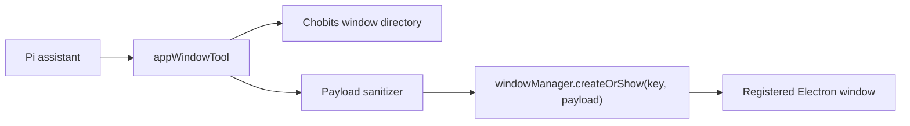

# AI Window Tool System

## 背景

`@aim-packages/window-manager` 已经提供窗口注册表与打开窗口能力：

- `window:config:list` / `listWindowKeys()` 可列出注册过的窗口 key。
- `window:config:get` / `getWindowConfig(key)` 可读取窗口配置快照。
- `window:open` / `windowManager.createOrShow(key, payload)` 可打开窗口并传递启动参数。

这些能力适合工程内部使用，但不适合直接裸露给 AI。完整 `WindowConfig` 包含路由、窗口 options、父子关系、调试开关等实现细节；AI 只需要知道“可以打开哪些业务窗口、每个窗口能接收哪些参数”。

## 目标

在 chobits 内增加一层 AI 可用的窗口工具：

1. AI 可以列出或搜索可打开的业务窗口。
2. AI 可以按白名单打开窗口，并传递受控 payload。
3. 工具复用现有 window manager，不新增窗口生命周期系统。
4. 默认不暴露内部浮层、气泡、升级动画、精灵特效等系统窗口。

## 架构



## 能力边界

工具参数：

- `action: "list" | "search" | "open"`
- `query?: string`
- `windowKey?: string`
- `payload?: Record<string, unknown>`

工具行为：

- `list` 返回 AI 允许打开的窗口摘要和 payload 字段说明。
- `search` 按 key、标题、描述、别名匹配窗口。
- `open` 先验证窗口是否在白名单中，再清洗 payload，最后调用 manager。
- 当前主进程实现使用 `windowManager.createOrShow(key, payload)`；如果后续要支持“与请求来源同屏”等策略，应在 chobits 工具 bindings 中显式接入 manager 的显示器选择能力，再把参数暴露给 AI。

## 发现策略

窗口工具不能只靠“打开窗口”这个显式说法触发。很多用户意图实际是窗口动作，但表达会落在业务词上，例如“预览这个资源”“播放这个视频”“打开这张图片”“进入资源库”。

因此发现链路分三层：

1. assistant profile 中明确提示：遇到“打开、预览、查看、播放、进入某个界面”时，要搜索应用窗口能力。
2. `toolbox.md` 的“资源查询与推送”章节同时挂载 `appWindowTool`，并说明拿到 `resourceId` 后可打开 `resourcePreview`。
3. `app-window-directory.ts` 的窗口目录为 `resourcePreview` 增加动作型别名，并使用 token 打分搜索，避免自然语言整句无法命中。

典型资源预览流程：

```ts
toolboxTool({ action: 'search', query: '预览资源 打开资源' })
resourceQueryTool({ query: '用户要看的资源' })
appWindowTool({ action: 'open', windowKey: 'resourcePreview', payload: { resourceId: '...' } })
```

## 白名单策略

窗口目录由 chobits 维护，而不是由 manager 自动生成。原因：

- manager 注册表知道“能打开”，但不知道“是否适合 AI 打开”。
- payload schema 是业务语义，应该放在 chobits。
- 内部窗口可能存在调试、动画、透明浮层等特殊行为，不应该被 AI 任意打开。

第一批可开放窗口：

- `settings`
- `resources`
- `chat`
- `chatOverlay`
- `assistant`
- `assistantMini`
- `pluginManager`
- `pluginDownload`
- `workspaceWizard`
- `resourcePreview`
- `tagger`
- `aiProviderConfig`
- `asrConfig`
- `asr`
- `ttsConfig`
- `tts`
- `webRecorder`
- `memoryGraph`
- `characterPackEditor`
- `windowAnimationEditor`

排除窗口：

- `menu`
- `status`
- `fileActionsMenu`
- `downloadFloating`
- `skillTree`
- `levelUp`
- `spriteBubbleFixedTop`
- `spriteEffect`

## Payload 规则

每个窗口可以定义自己的 sanitizer。未知字段默认丢弃。

当前支持：

- `settings`: `category`, `aiProviderId`
- `aiProviderConfig`: `providerId`, `presetId`, `fields`
- `asr`: `mode`, `cloudProviderId`, `cloudProviderPresetId`, `cloudModelId`, `audioSource`
- `chat` / `chatOverlay` / `assistant` / `assistantMini`: `initialMessage`, `providerId`, `modelId`, `preferredPresetId`, `presetId`, `agentId`, `codingWorkspaceRoot`, `codingWorkspaceLabel`, `webSearchEnabled`, `emojiPacksEnabled`, `characterPersonaEnabled`, `overlaySide`
- `windowAnimationEditor`: `presetId`
- `resourcePreview`: `resourceId`

## 当前实现

- 窗口目录与 payload sanitizer: `packages/ai/runtime/pi/app-window-directory.ts`
- Pi 工具实现: `packages/ai/runtime/pi/tools/app-window.ts`
- 工具注册与兼容名: `packages/ai/runtime/pi/tools/index.ts`, `packages/ai/runtime/pi/tool-registry.ts`
- 工具箱发现说明: `packages/ai/runtime/pi/toolbox.md`
- 工具调用展示文案: `packages/ai/runtime/pi/tool-labels.ts`

工具名：

- tool id: `app-window`
- compat name: `appWindowTool`

典型调用：

```ts
appWindowTool({ action: 'search', query: 'AI 设置' })
appWindowTool({ action: 'open', windowKey: 'settings', payload: { category: 'ai' } })
appWindowTool({ action: 'open', windowKey: 'assistantMini', payload: { initialMessage: '帮我整理一下当前工作' } })
```

安全返回：

- `payload` 返回实际传给窗口的清洗后参数。
- `payloadDropped: true` 表示调用方传了 payload，但所有字段都被丢弃。
- 非白名单窗口会返回错误和允许的 `allowedWindowKeys`，不会调用 manager。

## 后续扩展

- 为更多窗口补充 payload sanitizer。
- 把窗口目录同步到设置页，供用户开关“允许 AI 打开”。
- 对高风险窗口引入二次确认，例如关闭当前工作、覆盖配置、开始录制等。
- 如 manager 未来提供 typed metadata，可从 manager 读注册窗口，再由 chobits 白名单做交集。
