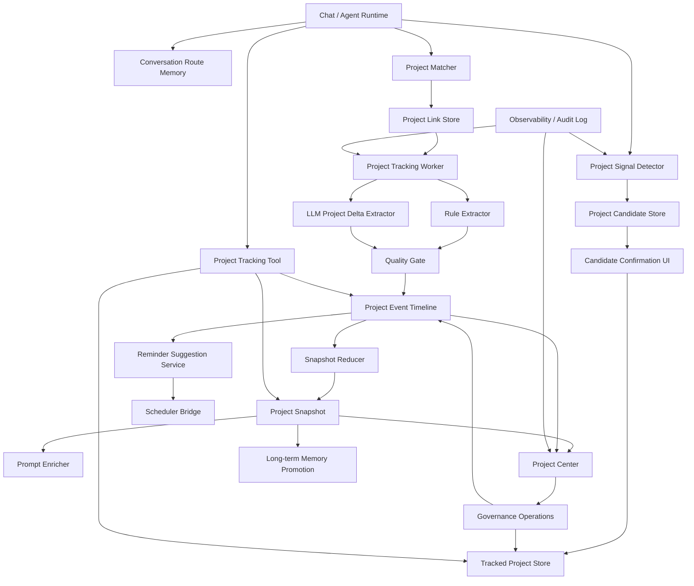

# 项目跟踪记忆系统完整能力蓝图

> 本文定义 Project Tracking Memory 的完整目标态、能力边界、成熟度路线、质量门槛和完成定义。
> 它不是下一阶段 todo，也不是第一版闭环说明，而是后续所有实现都要对齐的“全局蓝图”。
> 任何新增实现都应该能回答：它覆盖了本文哪一层能力，降低了哪个风险，是否满足对应验收门槛。

## 0. 文档定位

项目跟踪记忆系统需要四类文档共同约束，避免只围绕局部功能推进：

| 文档 | 作用 | 回答的问题 |
| --- | --- | --- |
| [主设计文档](./project-tracking-memory-design.md) | 产品、架构、第一版实现状态 | 这个系统为什么存在，第一版已经做到了哪里 |
| 本文：完整能力蓝图 | 完整目标态、能力边界、终局验收 | 完整的项目跟踪记忆系统应该具备什么 |
| [风险与增强设计](./project-tracking-memory-risk-and-enhancement-design.md) | 风险分层、增强方案 | 当前最危险的不足是什么，为什么要按质量、治理、提醒、LLM 的顺序增强 |
| [下一阶段实施计划](./project-tracking-next-implementation-plan.md) | 可执行任务包 | 下一轮开发应该改哪些文件，怎么验收 |

本文的约束优先级：

1. 完整目标态先于局部实现。不能因为第一版已经能创建项目，就把“项目跟踪”缩小成创建候选和显示项目条。
2. 用户控制先于自动化。任何自动识别、自动关联、自动写入和自动提醒都必须有可解释、可撤销、可审计的路径。
3. 可信状态先于智能抽取。LLM 增强必须落在质量门控、来源证据和用户确认之后。
4. 项目事实源必须可重建。快照、prompt 注入内容和推荐下一步都应由项目事件、里程碑和用户设置派生。
5. 后续实施必须覆盖“发现、确认、跟踪、治理、提醒、复盘、退出”完整生命周期。

## 1. 完整目标态

完整的项目跟踪记忆系统不是一个普通 todo 列表，而是 Chobits 的跨会话项目伙伴层。

它应该做到：

- 理解用户正在推进的长期事项，并区分一次性问题、普通偏好、长期目标和可跟踪项目。
- 在高置信但未确认时，用轻量确认浮窗请求用户确认，而不是擅自创建项目。
- 创建项目后，跨会话维护项目目标、范围、关键日期、任务、会议、协议、决策、计划变更、风险、阻塞和完成情况。
- 在用户换会话后，判断新对话是否与已有项目相关，并用可解释方式建议关联或在高置信条件下关联。
- 为 agent 注入压缩后的可信项目快照，使后续对话能延续项目上下文。
- 把关键时间点转成可确认、可撤销、可追溯的提醒建议，并通过 scheduler 触发。
- 让用户在项目中心查看、纠错、合并、拆分、归档、删除、导出和复盘项目。
- 在项目完成后沉淀复盘摘要，并按规则把稳定事实晋升到长期记忆，而不是把所有过程噪音都长期保存。
- 对敏感项目、错误提取和误关联提供清晰的关闭、删除和来源回溯能力。

完整系统必须持续满足三个关键词：

| 关键词 | 含义 |
| --- | --- |
| 可信 | 项目状态有来源、质量状态、确认路径和回滚能力 |
| 可治理 | 用户能纠错、合并、拆分、删除、导出、关闭和审计 |
| 可长期运行 | 有测试、观测、节流、迁移、回滚和数据生命周期管理 |

## 2. 完整生命周期

项目跟踪能力必须覆盖从项目被发现到项目退出系统的完整生命周期。

| 生命周期阶段 | 触发条件 | 系统行为 | 用户控制 | 完成标准 |
| --- | --- | --- | --- | --- |
| 项目发现 | 对话中出现持续目标、任务组、关键时间点、会议、协议或多轮推进信号 | 计算项目信号，生成候选或匹配已有项目 | 可以关闭自动识别或 dismiss 候选 | 不把普通问答误当项目，高风险候选必须等待确认 |
| 候选确认 | 候选置信度达到阈值 | 展示项目名、目标、原因、建议里程碑和提醒 | 创建、编辑后创建、稍后、不再提示 | 创建前用户清楚知道系统将开始跟踪什么 |
| 项目激活 | 用户确认或手动创建项目 | 写入 project、初始 link、初始事件和快照 | 可编辑项目名、目标、状态、别名 | 当前会话能看到项目关联状态 |
| 主动跟踪 | 已关联会话结束、用户手动补充、agent tool 写入 | 抽取项目事件，更新里程碑，归约快照 | 可接受、编辑、拒绝自动事件 | 项目快照反映开放事项、进展、时间点、决策和风险 |
| 跨会话关联 | 新会话提到已有项目或显式延续 | matcher 计算候选项目和置信度 | 选择项目、拒绝关联、解除关联 | 多项目歧义时不静默错误绑定 |
| Prompt 注入 | 当前会话已关联项目或高置信匹配 | 注入可信压缩快照和必要提醒 | 可关闭项目注入或解除关联 | 注入内容短、准、可来源回溯 |
| 质量审核 | 自动事件、LLM 事件、高风险事件生成 | 进入待确认队列或标记 accepted | 接受、编辑接受、拒绝、查看来源 | 未确认高风险内容不进入事实快照 |
| 提醒建议 | deadline、meeting、follow-up、blocked-too-long 等信号出现 | 生成 reminder suggestion | 确认、修改时间、取消、稍后 | scheduler 中存在可触发、可撤销的提醒 |
| 项目治理 | 误关联、重复项目、项目范围漂移、用户要求清理 | 支持解除、合并、拆分、归档、删除、导出 | 所有治理操作需要确认和可审计 | 没有孤儿 link、旧快照可重建、来源清楚 |
| 项目完成 | 目标达成、用户标记完成、长期无活动且用户确认 | 进入完成流程，生成复盘摘要 | 标记完成、继续跟踪、归档 | 完成状态、最终结果、遗留事项清晰 |
| 长期记忆晋升 | 项目产生稳定长期事实 | 只晋升项目目标、关键决策、偏好和复盘结论 | 用户可确认或关闭晋升 | 不把原始项目噪音写入长期记忆 |
| 归档与退出 | 用户归档、删除、导出或关闭项目跟踪 | 停止跟踪和注入，保留或清理数据 | 软删除、硬删除、导出、恢复 | 用户能明确结束系统对该项目的长期参与 |

## 3. 能力成熟度矩阵

项目跟踪系统不应只用“是否能跑通”来评估。需要按成熟度看它是否可被长期信任。

| 成熟度 | 名称 | 用户可感知能力 | 系统能力 | 完成定义 | 当前状态 |
| --- | --- | --- | --- | --- | --- |
| V1 | 端到端可用 | 能创建项目、关联会话、查看快照和时间线 | schema、repo、IPC、候选、项目条、规则抽取、快照、tool、项目中心 | 真实跨会话项目能被创建和持续更新 | 已完成第一版 |
| V2 | 可信治理 | 能纠错、审核、解除、导出、合并、拆分、删除 | 事件质量状态、待确认队列、审计日志、治理操作、专项测试 | 错误记忆不会静默污染项目状态 | 基础已落地，R1 dry-run/orphan 已补，撤销和集成测试待深化 |
| V3 | 提醒与智能抽取 | 能把关键时间点转成提醒，复杂会议纪要可拆解 | scheduler bridge、LLM Project Delta、supersede/cancel、提醒状态回写 | 复杂项目推进能被较高质量跟踪，但高风险内容仍确认 | 提醒编辑/重同步已落地，默认关闭的真实 LLM 路径和 mock 回归已补，supersede/cancel 待深化 |
| V4 | 项目智能层 | 能获得下一步建议、复盘、风险趋势、项目组合视图 | 推荐引擎、项目健康度、跨项目依赖、长期记忆晋升 | agent 能像项目伙伴一样帮助推进和复盘 | 后续规划 |
| V5 | 生态协作层 | 可连接外部日历、任务系统、文档和团队协作 | 外部 connector、权限边界、多账户/多工作区策略 | 项目状态能在 Chobits 与外部系统间可靠同步 | 远期规划 |

V1 是可用闭环，不是完整系统。完整系统至少要达到 V3 的质量和提醒闭环，并具备 V2 的治理能力。V4 和 V5 可以分阶段做，但文档和数据结构不应阻碍它们。

## 4. 目标架构



核心原则：

- `project_events` 是项目推进事实的主时间线。自动事件、用户事件、agent tool 事件都应该进入统一事件模型。
- `project_snapshots` 是派生缓存。任何项目写入、审核、合并、拆分、删除后都应可重建 snapshot。
- `project_links` 表达会话、任务、提醒、记忆和项目之间的关系。解除 link 不应删除原始会话。
- `ProjectContextEnricher` 只能注入可信、压缩、可来源回溯的内容。
- `ProjectTrackingTool` 是 agent 读取和显式写入项目状态的标准入口，不能绕过质量和权限策略。
- `Scheduler Bridge` 只处理用户确认后的提醒，不能把 suggestion 直接当作已创建提醒。
- `Long-term Memory Promotion` 只晋升稳定事实和复盘结论，不能把完整项目时间线复制到长期记忆。
- `Observability / Audit Log` 必须覆盖候选、关联、抽取、审核、提醒、治理、注入和错误。

## 5. 数据模型目标

当前 V1 已有项目、候选、事件、关联、快照、里程碑和提醒链接。完整能力需要补齐数据生命周期、质量状态和审计信息。

| 数据对象 | 已有职责 | 完整目标需要补齐 |
| --- | --- | --- |
| `tracked_projects` | 项目主体、状态、目标、别名、metadata | `deletedAt`、`completedAt`、`archivedAt`、`mergedIntoProjectId`、`splitFromProjectId`、敏感标记、项目级设置 |
| `project_candidates` | 候选项目、信号原因、建议里程碑和提醒 | dismiss 原因、冷却策略、相似候选去重、候选来源摘要 |
| `project_events` | 项目时间线事件 | `quality`、`needsUserConfirmation`、`reviewedAt`、`reviewedBy`、`evidenceQuotes`、`extractionReason`、`supersededByEventId`、`deletedAt` |
| `project_milestones` | 里程碑和状态 | 与事件来源绑定、完成证据、变更历史、取消原因 |
| `project_links` | conversation/task/reminder/memory 与 project 关联 | link 置信度、link 原因、解除原因、用户确认状态、link 审计 |
| `project_snapshots` | 项目压缩状态 | 版本号、归约输入范围、质量过滤策略、重建时间、prompt 注入预算 |
| `project_reminder_links` | 项目提醒建议和外部提醒关系 | scheduler task id、同步状态、取消状态、触发结果、用户修改记录 |
| `project_audit_logs` | V1 未建 | 记录创建、更新、审核、合并、拆分、删除、导出、提醒创建等治理操作 |
| `project_review_items` | 可由事件状态派生 | 统一待确认队列，承载事件、link、reminder、候选的审核状态 |

数据库演进要求：

1. 所有表字段变更先更新 `electron/main/db/schema.ts` 或对应 schema 定义。
2. 再执行 `./node_modules/.bin/drizzle-kit generate`。
3. migration 必须支持已有 V1 数据平滑升级。
4. 质量字段新增时，历史事件默认应按来源初始化：用户/agent tool 明确写入为 `accepted`，自动 worker 写入为 `draft` 或按迁移策略标记。
5. 删除、合并、拆分必须记录审计信息，避免项目中心、prompt 注入和 scheduler 留下孤儿引用。

## 6. UX 目标

完整系统需要把“自动记忆”做成用户可理解、可修正的体验。

| 界面 | 必备能力 | 不足时的风险 |
| --- | --- | --- |
| 候选确认浮窗 | 展示项目名、目标、识别原因、来源、建议里程碑；支持编辑创建、稍后、不再提示 | 用户不知道系统为什么要跟踪，容易觉得被打扰 |
| 当前项目条 | 展示当前会话关联项目、状态、开放事项数量、解除/切换入口 | 误关联后不容易发现，prompt 注入会放大错误 |
| 项目中心列表 | 状态筛选、搜索、归档筛选、最近活跃、风险/阻塞提示 | 项目一多就无法治理 |
| 项目详情 | 目标、状态、快照、时间线、里程碑、关联对象、提醒、设置 | 用户无法理解项目真实状态 |
| 待确认队列 | 自动事件、提醒建议、低置信 link、高风险变更的接受/编辑/拒绝 | 自动抽取错误会静默进入项目事实 |
| 治理对话框 | 解除关联、合并、拆分、软删除、硬删除、导出、恢复 | 重复项目和错误项目会积累成长期噪音 |
| 多项目消歧 | 当多个项目匹配时让用户选择或拒绝 | 新会话被错误绑定到相似项目 |
| 提醒确认面板 | 修改时间、标题、提前量、是否携带项目快照、撤销 | deadline 变成骚扰或错误提醒 |
| 完成与复盘 | 标记完成、总结结果、遗留事项、晋升长期记忆选项 | 项目永远 active，长期记忆缺少高质量结论 |
| 设置页 | 全局开关、自动识别、自动关联、prompt 注入、提醒建议、敏感项目策略 | 用户无法按信任程度调整自动化 |

UX 文案原则：

- 说明系统要跟踪的“项目对象”，而不是泛泛说“发现了记忆”。
- 任何自动动作都要能看到原因：来源对话、匹配词、置信度或抽取理由。
- 治理操作要显示影响范围：会改哪些事件、link、快照、提醒和长期记忆候选。
- 不用大段说明教育用户，功能入口应该出现在上下文需要它的地方。

## 7. 匹配、抽取与质量策略

### 7.1 项目匹配策略

匹配结果应该分为四级：

| 等级 | 条件 | 行为 |
| --- | --- | --- |
| 显式指定 | 用户直接说项目名、别名或“继续上次那个 X” | 可自动关联，但当前项目条必须可见 |
| 高置信单候选 | 项目名、目标、开放事项、关键日期多信号一致 | 可建议关联；用户开启自动关联时可自动 link |
| 中置信或多候选 | 多个项目相似，或只有部分信号匹配 | 弹出消歧，不自动写 link |
| 低置信 | 只有泛泛关键词或普通问答 | 不关联，只作为弱信号记录或忽略 |

自动关联必须满足：

- 项目处于 active 或 paused，不能自动关联 archived、completed、deleted 项目。
- 没有更高置信的其他项目。
- 最近未被用户对同类匹配 dismiss。
- 项目级和全局自动关联开关允许。
- link 记录 `confidence`、`reason` 和 `createdBy`。

### 7.2 事件抽取策略

事件抽取分为规则通道和 LLM 通道：

| 通道 | 适用场景 | 默认质量 |
| --- | --- | --- |
| 规则抽取 | 明确 deadline、meeting、todo、blocked、done 等简单信号 | 低风险可 accepted，高风险 draft |
| LLM Project Delta | 会议纪要、复杂计划变更、多行动项、隐式决策 | draft，除非是低风险且有强证据 |
| agent tool 写入 | 用户明确要求记录、agent 正在执行项目管理动作 | accepted，但仍保留来源 |
| 用户手动创建 | 用户在项目中心手动添加事件 | accepted |

高风险事件必须确认：

- `agreement_reached`
- `decision_made`
- `deadline_changed`
- `status_changed`
- `reminder_scheduled`
- 涉及合同、法律、财务、医疗、人事或外部承诺的事件

### 7.3 快照归约策略

快照只能把可信事件归约成当前项目状态：

- `accepted` 事件参与事实快照。
- `draft` 事件进入待确认，不作为事实注入 prompt。
- `rejected` 事件不参与快照，但保留审计或按清理策略删除。
- `superseded` 和 `cancelled` 事件不应继续显示为开放事项，但应能在时间线中解释变更。
- 快照必须保留归约输入范围和版本，便于重建和调试。

## 8. 提醒、推荐与计划闭环

完整提醒能力不是“识别到日期就创建提醒”，而是一条可确认链路：

1. extractor 或 matcher 发现 deadline、meeting、follow-up、blocked-too-long、review-needed。
2. reminder suggestion 生成标题、时间、项目、来源、建议提前量和置信度。
3. 用户确认或编辑 suggestion。
4. scheduler bridge 创建真实 task。
5. `project_reminder_links` 记录 scheduler task id 和同步状态。
6. 提醒触发时携带项目快照、开放事项、来源和推荐下一步。
7. 用户完成、延后、取消提醒时，状态回写项目事件或 reminder link。

推荐下一步需要遵循：

- 推荐来自项目快照、开放事项、阻塞、临近时间点和用户明确目标。
- 推荐必须区分“系统建议”和“用户已经承诺的事项”。
- 不把 draft 事件当作确定承诺。
- 不在项目已完成、归档或关闭提醒时继续推荐。

## 9. 与长期记忆的关系

项目跟踪和长期记忆必须分工清楚：

| 内容 | 项目系统 | 长期记忆 |
| --- | --- | --- |
| 项目时间线细节 | 保存，支持回溯 | 不保存完整细节 |
| 当前开放事项 | snapshot 派生 | 可在 Active Projects 中摘要 |
| 关键决策 | accepted 事件保存 | 高价值、稳定后可晋升 |
| 用户项目偏好 | 可作为项目 metadata | 稳定偏好可晋升 |
| 完成复盘 | 项目完成时生成 | 用户确认后可晋升 |
| 临时讨论和草稿 | 留在项目事件或会话 | 不晋升 |

晋升规则：

- 只有 accepted、用户确认或完成复盘中的稳定事实可晋升。
- 晋升内容必须短，保留 project id 或来源。
- 用户关闭项目长期记忆晋升时，不生成 Memory Note。
- 删除项目时，需要处理已晋升长期记忆的引用和清理提示。

## 10. 安全、隐私与控制

项目跟踪保存的是更强的长期结构，因此控制能力必须完整。

必须具备：

- 全局项目跟踪开关。
- 自动识别、自动关联、prompt 注入、提醒建议的独立开关。
- 项目级关闭跟踪、关闭注入、关闭提醒。
- 敏感项目标记，敏感项目默认不自动注入、不自动提醒或需要更强确认。
- 来源透明：事件、link、提醒都能回到 conversation id、seq 范围或用户操作。
- 数据导出：项目主体、事件、快照、里程碑、link、提醒、审计日志。
- 软删除和硬删除：软删除可恢复，硬删除需清理或标记关联数据。
- 外部动作确认：提醒、外部日历、任务系统、邮件或协作工具操作都不能静默执行。
- Prompt 注入防护：项目快照不能注入未经确认的外部指令，来源内容必须被当作数据而不是系统指令。

敏感风险场景：

| 场景 | 默认策略 |
| --- | --- |
| 法律、合同、医疗、财务、人事项目 | 自动事件 draft，高风险操作确认 |
| 多人协作或第三方承诺 | 协议、决策、deadline 需要确认 |
| 用户要求忘记或删除 | 停止注入，执行删除/导出/清理流程 |
| 上传文档包含项目计划 | 只抽取摘要和来源，不保存不必要全文 |
| LLM 抽取不确定 | 降级为 draft 或只生成 review item |

## 11. 观测、审计与运维

完整能力需要能回答“系统为什么这么做”和“质量是不是在变好”。

关键 analytics / log 事件：

- `project_candidate_generated`
- `project_candidate_confirmed`
- `project_candidate_dismissed`
- `project_auto_link_suggested`
- `project_auto_link_created`
- `project_link_removed`
- `project_event_extracted`
- `project_event_reviewed`
- `project_snapshot_rebuilt`
- `project_prompt_context_injected`
- `project_reminder_suggested`
- `project_reminder_created`
- `project_reminder_cancelled`
- `project_merged`
- `project_split`
- `project_exported`
- `project_deleted`
- `project_extraction_error`

质量指标：

| 指标 | 用途 |
| --- | --- |
| 候选确认率 / dismiss 率 | 调整项目信号阈值 |
| 自动关联接受率 / 解除率 | 评估 matcher 误关联 |
| 自动事件接受率 / 拒绝率 | 评估 extractor 质量 |
| 高风险事件确认率 | 评估质量门控是否过严或过松 |
| reminder suggestion 创建率 / 取消率 | 评估提醒噪音 |
| snapshot 重建耗时和失败率 | 评估长期运行稳定性 |
| prompt 注入 token 预算 | 防止上下文膨胀 |
| 用户治理操作次数 | 发现重复项目和误提取热点 |

运维要求：

- worker 失败不能阻塞聊天主链路。
- 所有异步任务需要节流、合并和 trailing-run 策略。
- 长项目需要分页加载时间线和限制 prompt 注入预算。
- debug 工具能重建单个项目 snapshot，清理测试项目，查看候选和事件来源。

## 12. 测试与验证策略

完整系统需要分层测试，不能只依赖 `tsc` 和手动点 UI。

| 层级 | 测试内容 |
| --- | --- |
| 单元测试 | signal、matcher、extractor、quality gate、snapshot reducer、prompt formatter、reminder suggestion |
| Repository 测试 | project/candidate/event/link/snapshot/reminder/audit CRUD，软删除、合并、拆分、迁移兼容 |
| Worker 集成测试 | 会话结束后候选生成、已关联会话事件抽取、snapshot 重建、错误隔离 |
| Prompt 注入测试 | token 预算、draft 过滤、敏感项目关闭、prompt injection 防护 |
| UI 测试 | 候选浮窗、项目条、项目中心、待确认队列、治理对话框、提醒确认 |
| Scheduler 桥接测试 | suggestion 创建、用户确认、task 创建、撤销、触发上下文、状态回写 |
| LLM 抽取回归集 | 会议纪要、多行动项、计划变更、取消事项、模糊日期、高风险承诺 |
| 数据生命周期测试 | 导出、软删除、硬删除、归档、恢复、合并后 orphan 检查 |

基础验证命令：

```bash
./node_modules/.bin/drizzle-kit generate
./node_modules/.bin/tsc --noEmit
./node_modules/.bin/eslint <changed-files>
pnpm test -- project-tracking
```

如果现有测试脚本不支持 `project-tracking` pattern，需要在实施时按项目已有 runner 调整，并把实际命令写回实施计划。

## 13. 发布、迁移与回滚

发布策略：

1. V1 保持低侵入，自动识别、自动关联、prompt 注入、提醒建议由设置控制。
2. V2 先发布质量状态、待确认队列和治理能力，再提高自动化。
3. V3 的 scheduler 和 LLM 能力必须在项目级开关和质量门控后发布。
4. V4 的推荐和健康度只能基于 accepted 项目事实。

迁移策略：

- schema 先行，migration 自动生成。
- 历史事件需要明确质量初始化规则。
- 旧 snapshot 在质量字段引入后必须重建。
- reminder link 与 scheduler task 的不一致需要有修复脚本或重同步入口。
- 删除、合并、拆分上线前要提供 dry-run 影响预览。

回滚策略：

- 关闭 feature flag 后，项目 worker 不再抽取新事件。
- prompt enricher 停止注入项目上下文。
- scheduler bridge 停止创建新提醒，但不静默删除已创建提醒。
- 数据保留，允许用户在项目中心导出或清理。
- migration 回滚不应丢失用户手动创建项目，除非用户明确删除。

## 14. 完整路线图

近期实施计划覆盖 Phase A-D，但完整路线至少包括下面阶段：

| Phase | 名称 | 主要目标 | 是否当前下一阶段 |
| --- | --- | --- | --- |
| A | 质量状态与测试底座 | 自动事件质量状态、待确认路径、核心测试 | 是 |
| B | 项目治理 UI 与操作 | 解除、导出、删除、合并、拆分、归档筛选 | 是 |
| C | Scheduler 提醒桥接 | suggestion、确认、scheduler task、撤销、状态回写 | 是 |
| D | LLM Project Delta | 复杂会议纪要、计划变更、supersede/cancel、高风险确认 | 是 |
| E | 观测与运维 | analytics、审计日志、worker 指标、debug/rebuild 工具 | 需要进入后续计划 |
| F | 隐私与数据生命周期 | 敏感项目、导出/删除完善、长期记忆引用清理 | 需要进入后续计划 |
| G | 完成、复盘与长期记忆晋升 | 项目完成流程、复盘摘要、Memory Note 晋升控制 | 需要进入后续计划 |
| H | 项目智能与组合视图 | 下一步推荐、风险趋势、跨项目依赖、项目组合面板 | 远期 |
| I | 外部生态协作 | 日历、任务系统、文档、团队协作连接器 | 远期 |

后续每次实现应该更新本文或实施计划中的覆盖状态，避免只有代码变化而目标态失真。

## 15. 完整完成定义

项目跟踪记忆系统达到“完整”至少需要满足：

- 用户能创建、编辑、拒绝、暂停、完成、归档、删除和导出项目。
- 系统能跨会话识别项目，但不会在低置信或多项目歧义时静默绑定。
- 每条项目事实都有来源、质量状态和可审计路径。
- 自动抽取、高风险事件、提醒和 LLM 输出都有待确认或质量门控。
- 项目快照可重建，prompt 注入只使用可信压缩内容。
- 用户能在项目中心处理错误关联、重复项目、错误事件、过期提醒和项目范围漂移。
- scheduler 提醒从 suggestion、确认、创建、触发、完成或取消形成闭环。
- 项目完成时有复盘流程，并能受控晋升长期记忆。
- 用户能按全局和项目级别关闭识别、关联、注入、提醒和长期记忆晋升。
- 有覆盖核心算法、repository、worker、UI、scheduler、数据生命周期和 prompt 注入安全的自动化测试。
- 有 analytics、审计日志、debug 工具和回滚策略支撑长期运行。
- 敏感项目、外部承诺和第三方信息默认采用更严格确认策略。

不满足下面任一条件时，不能声称系统完整：

- 只能创建项目，但不能纠错、合并、拆分、删除或导出。
- 能抽取事件，但没有质量状态和来源证据。
- 能注入 prompt，但不区分 draft 和 accepted。
- 能建议提醒，但不能确认、撤销或同步 scheduler 状态。
- 能显示项目中心，但不能处理误关联和重复项目。
- 能用 LLM 抽取复杂内容，但没有高风险确认和回归测试。
- 能完成第一版闭环，但没有发布、迁移、回滚和观测策略。

## 16. 关键开放决策

这些问题不阻塞 V2，但在进入 V4/V5 前需要明确：

| 问题 | 建议默认 |
| --- | --- |
| 是否接外部日历和任务工具 | 先只接内部 scheduler，外部连接器另行设计权限 |
| 是否支持多用户或团队项目 | 先按单用户本地项目设计，团队协作作为远期 |
| LLM 抽取的成本上限 | 只对已确认项目、长会话、会议纪要或用户主动请求触发 |
| 项目数据保留周期 | 默认长期保留，提供项目级归档、删除和导出 |
| 敏感项目是否默认注入 | 默认不自动注入，用户可项目级开启 |
| 长期记忆晋升是否自动 | 默认建议，不自动写入高风险事实 |
| 合并/拆分是否可撤销 | 至少保留审计和导出；可撤销能力视数据复杂度设计 |

## 17. 当前完成度映射

| 蓝图能力 | 当前状态 | 主要缺口 | 对应 phase |
| --- | --- | --- | --- |
| 项目发现与候选 | 第一版完成 | 阈值调优、候选去重、dismiss 反馈 | A/E |
| 用户确认创建 | 已完成 | 更丰富的来源解释和建议项编辑 | A/B |
| 当前会话关联 | 已完成 | 多项目切换、link 原因展示 | B |
| 跨会话匹配 | 第一版完成 | 多候选消歧、link 审计、自动关联质量指标 | A/E |
| 事件抽取 | 质量门控、默认关闭的真实 LLM 调用路径、mock 回归已落地 | 更多会议纪要回归集、supersede/cancel 精准识别 | A/D |
| 快照归约 | draft 过滤已落地 | 归约输入版本、重建审计详情 | A/E |
| Prompt 注入 | 已完成 | 注入质量层级、敏感项目策略、注入指标 | A/F/E |
| Agent Tool | B-G 查询/部分写入和 R1 只读治理查询已扩展 | 硬删除等高风险治理仍保留 UI 侧确认，不开放给 tool | A/B/G |
| 项目中心 | B-G 控制台和 R1/R2/R4 视图已落地 | 组合视图、UI 自动化测试、批量治理 | A/B/C/F/G |
| Scheduler 提醒 | 内部 scheduler bridge、编辑、重同步、完成、触发状态回写已落地 | 提前量、触发通知、外部日历同步 | C/I |
| 治理能力 | 合并/拆分/删除/导出/解除、impact preview、orphan report 已落地 | 撤销、合并/拆分专属 dry-run、批量治理 | B/E/F |
| 长期记忆晋升 | 完成复盘、晋升、晋升前内容预览、删除引用处理策略已落地 | 长期事实去噪、更细 diff、可选同步删除策略 | F/G |
| 观测与测试 | 审计日志、服务测试和 extractor 回归已落地 | analytics、worker 集成测试、UI 测试、质量指标 | A/E |
| 项目智能 | 未实施 | 下一步推荐、健康度、组合视图 | H |
| 外部生态协作 | 未实施 | 日历、任务、文档、团队协作 connector | I |

这张映射表是后续实施时的最低检查清单。新增功能如果只改善某个局部能力，也必须说明它没有覆盖哪些缺口，避免把局部完成误判成整体完成。

## 18. R 阶段补齐口径

Phase A-G 基础实现后，R 阶段残余深化包已完成基础落地。R 阶段的完成定义与当前状态如下：

- 治理动作执行前有 dry-run 影响范围，执行后有 orphan 检查：已基础落地。
- 已创建提醒可以编辑、重同步、手动完成，并能解释 scheduler/link 状态差异：已基础落地。
- LLM Project Delta 接上真实调用路径或明确配置关闭，同时有 mock chatFn 回归测试：已基础落地，默认关闭。
- 长期记忆晋升和删除项目时能展示/处理 Memory Note 引用：已基础落地，默认只解除项目引用。
- 文档不再保留和当前状态冲突的旧版“待实现”描述：已同步。
- 至少补齐 service/extractor 级测试：已补；repository、scheduler bridge 和 UI 测试继续作为深化项。

R 阶段不包含：

- 项目健康度、下一步推荐和组合视图。这些属于 Phase H。
- 外部日历、任务系统、文档和团队协作连接器。这些属于 Phase I，需要单独权限设计。

## 19. 当前未完成项与后续规划摘要

截至 2026-07-03，R 阶段基础能力已落地。完整成熟系统仍有以下后续工作：

| 层级 | 事项 | 状态 | 规划 |
| --- | --- | --- | --- |
| 可信运行深化 | repo/worker/scheduler/UI 集成测试 | 未完成 | 优先补齐，保护治理预检、提醒同步、LLM fallback 和硬删除清理链路 |
| 可信运行深化 | 撤销一次治理操作 | 未完成 | 基于 audit/export/undo journal 设计软删、合并、拆分的恢复路径 |
| 可信运行深化 | 合并/拆分专属 dry-run | 未完成 | 在总量 preview 之外展示具体迁移清单、冲突和目标 snapshot 影响 |
| 抽取质量深化 | supersede/cancel 精准识别 | 未完成 | 结合规则和 LLM 样本，识别取消事项、方案替换和延期 |
| 抽取质量深化 | LLM 真实样本回归集 | 未完成 | 覆盖会议纪要、多行动项、模糊日期、高风险承诺和计划变更 |
| 生命周期深化 | 长期记忆保留周期和可选同步删除 | 未完成 | 设计 Memory Note 引用保留、删除前 diff 和二次确认 |
| 观测运维 | 指标与 debug 面板 | 未完成 | 增加候选确认率、自动关联解除率、事件接受/拒绝率、提醒取消率和 worker/scheduler 错误指标 |
| Phase H | 项目智能层 | 未实施 | 下一步建议、项目健康度、风险趋势、跨项目依赖、项目组合视图 |
| Phase I | 外部生态协作 | 未实施 | 外部日历、任务系统、文档系统、团队协作 connector；需要单独权限和撤销设计 |

详细任务包以[下一阶段实施计划的当前未完成项与后续规划](./project-tracking-next-implementation-plan.md#03-当前未完成项与后续规划)为准。
