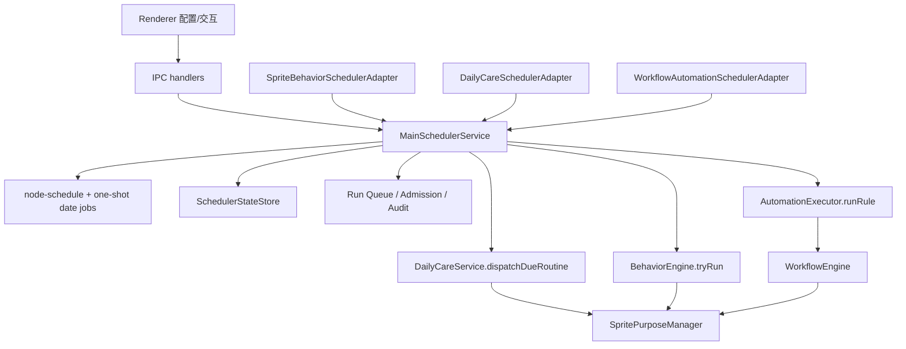

# 主进程统一调度系统规划

## 背景

现在系统里至少有三套“到点触发动作”的机制：

1. 精灵自主行为：`packages/sprite-core/behavior-engine.ts`
2. 日常关心模式：`electron/main/daily/*`
3. 工作流自动化：`electron/main/handlers/automation/*` 与 `electron/main/handlers/scheduler.ts`

它们都在主进程链路里运行或被主进程驱动，但各自维护时间、冷却、幂等、启停和执行记录。继续分别修补会让行为越来越散：自动行走、日常提醒、工作流 cron 都会有自己的计时器、自己的跳过逻辑、自己的恢复策略。

目标不是把业务都塞进同一个类里，而是做一个主进程的统一调度基础设施：时间与触发统一，业务判断与执行仍留在各自领域服务里。

## 现状结论

### 精灵自主行为

`BehaviorDefinition.schedule` 已经定义了 `interval`、`random`、`cron-like`，并带有条件、概率、冷却、每日上限、状态约束、等级和好感度约束。

当前 `BehaviorEngine.start()` 使用 `setInterval(() => this.tick(), this.tickInterval)` 每秒轮询。`SpriteManager` 在 Electron main 的 `initSpriteManagerIPC()` 中初始化并启动，所以日志里的：

```text
behavior triggered: ❤❤❤❤❤ 自动行走 ❤❤❤❤❤
behavior completed: ❤❤❤❤❤ 自动行走 ❤❤❤❤❤
```

是主进程里的 `BehaviorEngine` 打出来的，不是 renderer 定时器。renderer 只是通过 IPC 上报 click、hover、context-menu 等交互。

已存在的右键菜单处理也符合这个方向：`AssistantMenuPage` 打开菜单时上报 `sprite.interact('context-menu', { open: true })`，`SpriteManager.reportInteraction()` 将 `context-menu` 放入 `movementSuspensionReasons`，`MovementCoordinator.canUseMovement()` 会因此阻止自动移动。后续统一调度系统应把它抽象成“调度准入条件”，而不是只在自动行走里补一个 if。

### 日常关心模式

`DailyCareService` 是 Electron main 单例，由 `initDailyCare()` 创建。它自己维护：

- `setInterval(() => this.tick(), MINUTE)`
- 系统 idle 判断
- resume/unlock 冷却
- `interval`、`fixed`、`calendar` 三类日程
- snooze、lastTriggeredAt、lastTriggeredOn、persistent notice
- daily-care 事件到 Sprite Purpose 的桥接

需要注意一个现存问题：`MINUTE = 30 * 1000`，但 schedule 字段语义是“分钟”。这会让 `minutes * MINUTE` 的真实间隔变成配置值的一半。无论这是调试残留还是刻意加速，迁移时都必须明确恢复为真实分钟，或者提供开发模式倍率。

### 工作流自动化

仓库已经有 `node-schedule`，当前只被 `electron/main/handlers/scheduler.ts` 使用：

- 启动时读取 `automation_rules`
- 只注册 `triggerType === 'schedule'` 且 enabled 的规则
- 用 `triggerConfig.cron` 建 `schedule.scheduleJob()`
- 到点后直接 `runWorkflow()`

自动化的 `manual`、`resource_event`、`system_event` 不走这个 scheduler，而是在 `automation/ipc-main.ts` 里分别处理。也就是说现在工作流自动化已经有“定时调度器”，但它只覆盖 cron，缺少统一执行入口、运行状态、重试、冲突控制和审计。

当前实现还有一个风险：`automation:updateRule` 调用 `scheduleRule(updated)`，但 `scheduleRule()` 一开始就因为 disabled 或 triggerType 不是 schedule 而 return，旧 job 不会被取消。规则从 enabled 改成 disabled，或从 schedule 改成 resource_event 时，旧 cron job 可能继续存在。统一调度后这类启停应由 registry 的 upsert/remove 保证。

## 设计原则

1. 调度必须在 Electron main process 里运行，renderer 只负责配置和交互事件上报。
2. 统一“什么时候触发”，不统一“业务应该做什么”。
3. `BehaviorEngine` 不消失，它保留行为条件、概率、冷却、状态约束等领域判断；只是把“每秒全量扫描”迁到统一调度器按 job 唤醒。
4. `DailyCareService` 不消失，它保留消息模板、snooze、persistent notice、routine 状态和 daily-care purpose bridge；只是把“30 秒轮询”迁到统一调度器按 routine 唤醒。
5. 工作流自动化保留 `automation_rules` 作为规则来源；统一调度器接管 schedule 注册、启停、并发和审计。
6. `node-schedule` 可以作为 cron/date 的底层引擎，但不能直接散落在业务模块里。业务只注册 `ScheduleSpec`，底层库由 `MainSchedulerService` 包装。
7. Purpose/Routine 仍是“触发后的角色表现编排”，不是调度系统。Scheduler 决定到点；Behavior/DailyCare/Automation 决定是否执行；Purpose/Routine 决定角色怎么表现。

## 目标架构



## 核心模块

### MainSchedulerService

建议路径：`electron/main/scheduler/`

职责：

- 注册、更新、移除调度 job
- 把不同 schedule 类型转换到底层 `node-schedule` 或一次性 Date job
- 统一处理 app 启动、休眠、唤醒、锁屏、解锁
- 统一处理 enabled、pause、cooldown、dailyLimit、singleton、coalesce
- 统一执行记录和错误日志
- 提供 IPC 查询调度状态，方便以后做“调度中心”界面

不负责：

- 不决定精灵该不该自动走
- 不决定日常关心提醒文案
- 不解析工作流节点
- 不替代 Sprite Purpose/Routine

### ScheduleSpec

统一 schedule DSL 可以覆盖当前三类业务：

```ts
type ScheduleSpec =
  | { kind: 'cron'; expression: string; timezone?: string }
  | { kind: 'date'; at: number; timezone?: string }
  | { kind: 'interval'; everyMs: number; alignTo?: 'start-of-minute' | 'start-of-hour'; window?: TimeWindow; daysOfWeek?: number[] }
  | { kind: 'randomInterval'; minMs: number; maxMs: number; window?: TimeWindow; daysOfWeek?: number[] }
  | { kind: 'fixedTime'; times: string[]; timezone?: string; daysOfWeek?: number[] }
  | { kind: 'calendar'; repeat: 'once' | 'yearly'; time: string; date?: CalendarDate; nthWeekday?: NthWeekday; leadMs?: number; timezone?: string }
  | { kind: 'event'; eventType: string }
  | { kind: 'manual' };
```

映射关系：

| 现有系统 | 当前字段 | 目标 ScheduleSpec |
| --- | --- | --- |
| BehaviorEngine | `schedule.type = interval` | `interval` |
| BehaviorEngine | `schedule.type = random` | `randomInterval` |
| BehaviorEngine | `schedule.type = cron-like` | 第一阶段废弃或显式转为 `cron` |
| DailyCare | `RoutineSchedule.interval` | `interval` |
| DailyCare | `RoutineSchedule.fixed` | `fixedTime` |
| DailyCare | `RoutineSchedule.calendar` | `calendar` |
| Automation | `triggerConfig.cron` | `cron` |
| Automation | `resource_event/system_event/manual` | `event` / `manual` |

### SchedulerJobDefinition

```ts
interface SchedulerJobDefinition<TPayload = unknown> {
  id: string;
  owner: 'sprite.behavior' | 'dailyCare' | 'automation' | string;
  name: string;
  enabled: boolean;
  schedule: ScheduleSpec;
  payload: TPayload;
  runPolicy?: {
    singletonKey?: string;
    coalesceKey?: string;
    cooldownMs?: number;
    dailyLimit?: number;
    maxConcurrent?: number;
    misfire?: 'skip' | 'run-once' | 'catch-up';
    retry?: { maxAttempts: number; backoffMs: number };
  };
  admission?: {
    skipWhenSystemIdle?: boolean;
    allowWhenLocked?: boolean;
    resumeCooldownMs?: number;
    requiredCapability?: string;
    customGate?: string;
  };
}
```

`customGate` 不直接序列化函数。业务 adapter 在注册时绑定 gate handler，例如：

- `sprite.canAutoMove`
- `sprite.contextMenuClosed`
- `dailyCare.canNotify`
- `automation.workflowEngineReady`

### SchedulerStateStore

调度定义仍由业务模块持有：

- sprite behavior 定义在 code/角色配置里
- daily-care 定义在 constants 和 daily-care json 里
- automation rule 定义在 `automation_rules` 表里

Scheduler 只持久化运行态：

```ts
interface SchedulerRuntimeState {
  jobId: string;
  owner: string;
  enabled: boolean;
  lastRunAt?: number;
  nextRunAt?: number;
  lastFinishedAt?: number;
  lastStatus?: 'success' | 'skipped' | 'failed';
  lastSkipReason?: string;
  dailyRunCount?: number;
  dailyResetDate?: string;
  consecutiveFailures?: number;
  updatedAt: number;
}
```

第一阶段可以放在 `app.getPath('userData')/scheduler-state.json`，避免和工作空间 DB 生命周期纠缠。后续如果要做调度中心、运行历史、跨空间自动化审计，再迁到 SQLite 表。

## 三条业务线如何接入

### 1. SpriteBehaviorSchedulerAdapter

目标不是删除 `BehaviorEngine`，而是让它不再拥有自己的全局 `setInterval`。

迁移后：

1. `registerDefaultBehaviors(mgr)` 仍注册行为定义。
2. `BehaviorEngine.register()` 只保存定义和运行态。
3. adapter 为每个 behavior 注册一个 scheduler job。
4. 到点后 scheduler 调用 `behaviorEngine.tryRunBehavior(id)`。
5. `tryRunBehavior()` 内部继续执行原来的条件、概率、状态、等级、冷却、dailyLimit 检查。

自动行走的统一准入：

- capability `movement` 必须解锁，当前已降到 1 级
- `autoWalkEnabled === true`
- sprite state 允许 idle/bored
- `movementSuspensionReasons` 为空
- 右键菜单打开时 `context-menu` gate 为 false，job 被 skip，不产生行走

这样“右键菜单展开时不要自由行走”不再是自动行走行为的特殊补丁，而是所有移动类行为共享的准入规则。

### 2. DailyCareSchedulerAdapter

`DailyCareService` 保留 routine 状态和 dispatch 逻辑，但移除全局 tick：

1. `rebuildRuntimes()` 后为每个 enabled routine 注册 scheduler job。
2. interval/fixed/calendar 转换为 ScheduleSpec。
3. 到点后 scheduler 调用 `dailyCareService.dispatchIfDue(routineId, scheduledAt)`。
4. `DailyCareService` 继续检查 snooze、idle、resume cooldown、oncePerDay、lastTriggeredOn。
5. dispatch 后继续发 notice，并通过 existing bridge 转成 Sprite Purpose。

关键变化：

- 不再用 30 秒轮询所有 routine。
- fixed/calendar 可以精确注册下一次时间。
- interval 可显式选择是否 align。
- `MINUTE = 30 * 1000` 需要改成真实 `60 * 1000`，开发加速用单独 `timeScale`。

### 3. WorkflowAutomationSchedulerAdapter

当前 `electron/main/handlers/scheduler.ts` 应迁移为 automation adapter：

1. 启动时读取 `automation_rules`。
2. schedule rule 注册为 `cron` job。
3. resource/system/manual 不一定有时间表，但也通过统一 `AutomationExecutor.runRule(rule, trigger)` 执行，保证并发、日志和错误处理一致。
4. create/update/delete/toggle 时调用 scheduler registry 的 `upsert/remove`，先取消旧 job，再按新配置注册。
5. rule disabled 或 triggerType 改变时必须取消旧 job。

这样工作流自动化的“定时触发”和“事件触发”不再分裂成两套执行路径。

## 主进程生命周期

建议启动顺序：

1. App ready 后初始化数据库、协议、窗口基础能力。
2. 创建 `MainSchedulerService`，但先处于 paused/booting 状态。
3. 初始化 workflow engine，保证 scheduled workflow 能执行。
4. 初始化 IPC handlers，并把 scheduler 注入 daily-care、automation、sprite manager 初始化链路。
5. 各 adapter 注册 job。
6. scheduler `start()`，计算 nextRunAt 并激活底层 jobs。
7. renderer ready 后发 `APP_STARTED`，system_event automation 也通过统一 executor 触发。

如果暂时不调整 `createWindow()` 内部的 handler 初始化顺序，可以做过渡方案：

- `MainSchedulerService` 先全局初始化。
- `DailyCareService` 和 automation handler 先注册 definition。
- `initWorkflowSystem()` 完成后调用 `scheduler.markDependencyReady('workflow')`。
- 依赖 workflow 的 job 在依赖 ready 前只登记不运行。

## 错过触发与恢复策略

不同业务默认策略不同：

| 业务 | App 关闭期间错过 | 休眠/锁屏后恢复 | 系统 idle |
| --- | --- | --- | --- |
| 自动行走/idle 小动作 | skip | skip 到下一次随机时间 | skip |
| 普通 daily-care | 默认 skip | resume cooldown 后 run-once 可选 | skip |
| urgent/nightGuard | run-once 可选 | 可绕过普通 cooldown | allow |
| workflow cron | 默认 skip | 下一次 cron | 不关心 idle |
| 用户手动触发 | 立即执行 | 立即执行 | 不关心 idle |

调度器只做通用 misfire 策略；具体要不要补一次由 job policy 配置。

## 与前面几个体验问题的关系

1. 自由移动 1 级解锁：这是 capability 定义问题，不应由 scheduler 决定等级。scheduler 只读取 capability runtime 的结果做准入。
2. 右键菜单打开不自由行走：这是 scheduler admission 的典型场景。context-menu open 进入 `movementSuspensionReasons`，移动类 job 到点时 skip。
3. 精灵视频编辑器拖动首尾滑块后不要误添加中间 loop：这是 renderer 编辑器的 pointer intent 问题，不属于主进程调度。正确设计是区分 `drag-handle` 与 `click-middle`，只有明确点击中间轨道才创建 loop segment；拖拽结束只提交 start/end 边界。

## 分阶段实施

### Phase 0：补齐安全修复

- 修复 automation rule disabled/type change 后旧 cron job 不取消的问题。
- 明确 daily-care `MINUTE = 30 * 1000` 是否是调试倍率；如果不是，改成真实分钟。
- 给 `BehaviorEngine` 增加 `tryRunBehavior(id, options?)`，先复用现有 tick 内部逻辑。

### Phase 1：建立主进程调度基础设施

- 新增 `electron/main/scheduler/`
- 封装 `node-schedule`
- 支持 `cron`、`date`、`interval`、`randomInterval`
- 支持 upsert/remove/start/stop/status
- 支持 `scheduler-state.json`
- 新增基础测试：注册、更新、取消、disabled、random reschedule、cron invalid

### Phase 2：迁移工作流自动化

- 将 `electron/main/handlers/scheduler.ts` 改为 adapter 或删除旧 jobs map。
- `automation:create/update/delete/toggle` 走 scheduler registry。
- 统一 `AutomationExecutor.runRule()`，manual/resource/system/schedule 共用。
- 加测试覆盖 disabled 后不再触发。

### Phase 3：迁移 daily-care

- `DailyCareService.start()` 不再创建全局 interval。
- `rebuildRuntimes()` 后 upsert routine jobs。
- 到点触发 `dispatchIfDue()`。
- 保留 daily-care storage 和 IPC API。
- 修复真实分钟语义或引入 dev timeScale。

### Phase 4：迁移 sprite behavior

- `BehaviorEngine.start()` 支持 legacy polling 与 scheduler mode。
- `SpriteBehaviorSchedulerAdapter` 注册所有 behavior jobs。
- 自动行走、idle-action、emotion、ambient 等都由 scheduler 唤醒，再由 BehaviorEngine 做领域判断。
- 移动类行为统一使用 `sprite.canAutoMove` gate。

### Phase 5：可视化和运维

- 增加主进程 IPC：`scheduler:listJobs`、`scheduler:getJob`、`scheduler:triggerNow`、`scheduler:pauseJob`。
- 设置页或调试页展示 job、nextRunAt、lastStatus、skipReason。
- 将运行历史从 state 扩展为 audit log。

## 测试策略

- Scheduler unit tests：fake clock、invalid cron、update cancellation、random interval bounds、misfire policy。
- Automation integration tests：创建 schedule rule、禁用 rule、修改 triggerType、删除 rule。
- DailyCare tests：interval/fixed/calendar、snooze、oncePerDay、idle skip、resume cooldown。
- Sprite behavior tests：condition false skip、probability 0 skip、dailyLimit、movement suspended skip。
- Main-process boundary tests：确保 adapter 只在 Electron main 初始化，不从 renderer 直接创建 scheduler。

## 最终判断

可以统一，但统一点应该是“主进程调度基础设施”，不是把 `BehaviorEngine`、`DailyCareService` 和 `AutomationRules` 合并成一个巨大业务引擎。

这套方案会让三个方向共享：

- 同一套主进程调度入口
- 同一套注册、更新、取消、状态查询
- 同一套底层 `node-schedule` 包装
- 同一套 pause/admission/misfire/concurrency 规则

同时保留三个方向各自最重要的领域能力：

- BehaviorEngine 保留精灵行为判断
- DailyCare 保留关怀语义和提醒状态
- Automation 保留规则配置和工作流执行
