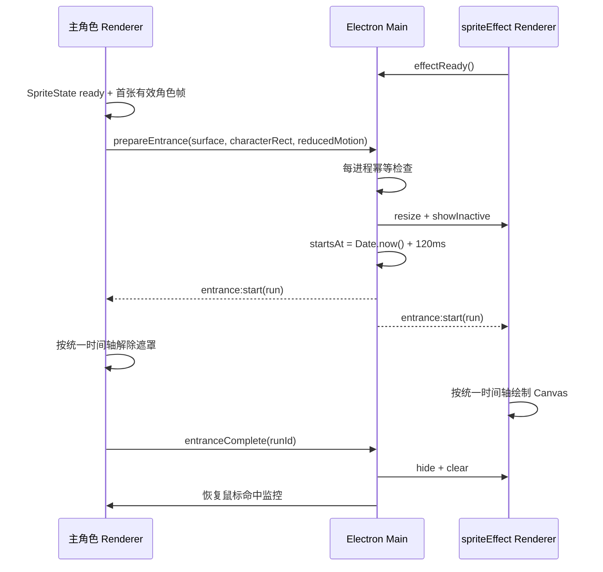

# AI 桌面助手粒子扫光出场效果实施方案

更新时间：2026-07-14

## 0. 文档状态

当前状态：代码实施完成，自动化验证通过，等待用户启动应用进行最终视觉验收。

本文档用于指导 AI 桌面助手冷启动时的粒子扫光出场效果落地。方案复用现有 `spriteEffect` 透明跟随窗口，由主角色窗口负责角色显现遮罩，特效窗口负责扫描光带、粒子、闪光和残留辉光，两者通过同一个主进程时间戳同步。

实施进度：

- [x] Phase 1：共享类型、时间轴与 IPC 契约
- [x] Phase 2：主进程出场协调器与特效窗口生命周期
- [x] Phase 3：角色首帧 ready、遮罩显现和交互门控
- [x] Phase 4：Canvas 粒子扫描渲染器
- [x] Phase 5：自动化测试、类型检查和构建
- [ ] 用户手动视觉验收：真实透明窗口中的扫线对齐、观感和回收

已完成实现：

- 新增共享时间轴、几何校验、标准/reduced-motion 运行参数和 IPC channels。
- 新增每进程一次的主进程协调状态机，包含发送者校验、特效页 ready 等待、统一未来时间戳、完成兜底和输入恢复。
- `spriteEffect` 出场期间会保护窗口不被普通特效的 hide/resize 请求打断。
- `VideoSprite`、`ThreeSprite` 已增加首帧 ready 回调。
- `AIAssistant` 已接入从下向上的角色遮罩、首帧 fallback、prepare watchdog、交互/UI 门控和 fail-open。
- `SpriteEffectPage` 已常驻挂载 Canvas 出场特效，粒子使用固定 seed 生成。
- 已新增时间轴、粒子、hook、视频首帧和主进程多窗口协调测试。

已验证：

- `pnpm exec vitest run test/assistant-entrance-hook.spec.tsx test/assistant-entrance.spec.ts test/window-handlers.spec.ts test/sprite-renderer-mount.spec.tsx`
- `pnpm exec tsc --noEmit`
- `pnpm exec vite build`
- 本功能新增文件及核心改动通过定向 ESLint；仓库原有 `VideoSprite` effect 内同步 setState 规则错误不属于本次变更。

## 1. 背景

当前应用已有一个 `spriteEffect` 窗口，用于在桌面精灵上方播放经验、好感度等特效。该窗口已经具备本需求需要的大部分桌面窗口能力：

- 透明背景、无边框、无阴影。
- 始终置顶，但不抢占焦点。
- 鼠标事件穿透，不阻挡用户操作其他窗口。
- 作为主精灵窗口的 follower，以中心重叠方式跟随移动。
- 启动阶段预创建，减少首次播放时的窗口加载延迟。

但单独在 `spriteEffect` 窗口绘制粒子并不能让另一个 BrowserWindow 中的角色真正“被扫描出来”。如果角色窗口从一开始就完整可见，扫描线只会成为覆盖在角色上方的装饰，无法形成出场效果。

因此需要两个窗口协同：

```text
主角色窗口：角色视频/3D 内容 + 从下到上的显现遮罩
特效跟随窗口：扫描线 + 光带 + 粒子 + 顶部闪爆 + 残留辉光
Electron 主进程：准备窗口、生成统一时间轴、控制输入与回收
```

## 2. 目标

- 每次应用冷启动时，AI 桌面助手只播放一次完整出场效果。
- 扫描从角色底部向顶部推进，扫描经过的区域才显示角色。
- 粒子与角色显现边界保持同步，不能出现明显错位或先后启动。
- 出场效果使用现有 `spriteEffect` 独立窗口，不污染普通 XP/好感特效语义。
- 出场过程中不响应点击、双击、拖拽、文件投递和右键菜单。
- 特效窗口不获取焦点，所有粒子区域保持鼠标穿透。
- 角色资源或特效窗口加载失败时必须 fail-open，不能永久隐藏角色。
- HMR、React StrictMode 重挂载、窗口隐藏后重新显示时不重复播放。
- 支持 `prefers-reduced-motion`，降低动画时长和粒子密度。

## 3. 非目标

- 第一版不提供设置页中的颜色、粒子数量、持续时间编辑器。
- 第一版不做全屏粒子，不覆盖整个桌面，只覆盖主角色窗口范围。
- 第一版不使用 WebGL shader、Three.js 后处理或视频像素级轮廓采样。
- 第一版不把“是否已经播放”写入数据库或偏好设置。
- 第一版不定义“安装后终身只播放一次”；播放粒度是每个主进程生命周期一次。
- 不修改角色包的 `appear` 动画资源格式，现有 `appear` trigger 继续有效。

## 4. 现有实现与约束

### 4.1 主窗口启动时机

`electron/main/index.ts` 当前等待 `app:renderer-ready` 和最短 splash 时间后显示主窗口。`app:renderer-ready` 由 React 根节点挂载后立即发送，它不能证明：

- SpriteState 已完成初始化。
- 当前角色视频已经加载出第一张有效帧。
- `spriteEffect` 页面已经挂载并订阅出场 IPC。

新方案不依赖 React 根节点 ready 作为动画 ready。角色内容默认处于隐藏遮罩状态，角色渲染器报告第一帧后才请求主进程启动出场。主窗口即使已经显示，也只有透明像素，不会闪现完整角色。

### 4.2 特效窗口尺寸

现有 `spriteEffect` 默认尺寸是 `420 x 260`，并设置了 `360 x 220` 的最小尺寸。出场效果要求特效窗口与主窗口完整重合，因此需要：

- 将 `spriteEffect` 的最小尺寸降低到窗口 handler 已允许的 `120 x 80`。
- 出场开始前按主角色窗口总尺寸调整 `spriteEffect`。
- 以主窗口左上角为共同坐标系，把 `characterRect` 传给 Canvas。
- 普通特效仍可按自身 `surface` 把窗口恢复到对应尺寸。

### 4.3 普通特效可见性竞争

`PersonaGainEffects` 会根据气泡模式和队列是否为空调用 `effectSetVisible(false)`。出场期间如果该调用隐藏了 `spriteEffect`，粒子会中途消失。

主进程在出场状态为 `preparing/running` 时忽略普通特效发出的隐藏和 resize 请求。出场完成后由协调器主动隐藏窗口，之后恢复现有普通特效逻辑。

### 4.4 角色动画尺寸变化

角色动画切换可能改变 `width / height / padding`。第一版以出场准备时的角色矩形作为一次运行的固定坐标，不在 1.7 秒内动态重排粒子。现有 `appear` trigger 应在扫描主体完成后触发，让尺寸变化尽量发生在残留粒子阶段。

## 5. 视觉设计

### 5.1 时间轴

标准动画总时长 `1700ms`：

| 阶段 | 时间 | 角色窗口 | 特效窗口 |
|---|---:|---|---|
| 聚能 | `0-120ms` | 角色不可见 | 脚下形成低亮度椭圆光晕和少量预热粒子 |
| 扫描 | `120-1150ms` | 遮罩从底部向顶部解除 | 青白色扫描线、柔光带、上浮粒子和短光丝 |
| 顶部闪爆 | `1050-1250ms` | 角色接近完全显示 | 扫描线到达顶部，出现一次克制的闪光和扩散环 |
| 残留 | `1150-1700ms` | 角色完全显示 | 少量粒子继续上浮，角色边缘辉光衰减 |
| 完成 | `1700ms` | 恢复所有 UI 和交互 | 清空 Canvas 并隐藏 `spriteEffect` |

第一版保留现有 `SPRITE_SYSTEM_READY -> appear` 生命周期时机，角色包的 `appear` 动画可与扫描过程并行播放。若实际观感需要让动作严格落在粒子尾段，再单独调整系统 ready 与欢迎消息时序，避免本功能直接改变全局启动事件语义。

### 5.2 色彩

第一版使用固定的多色科技感色板：

- 扫描核心：`rgba(245, 252, 255, 1)`
- 主辉光：`rgba(60, 220, 255, 0.9)`
- 次级粒子：`rgba(80, 255, 210, 0.75)`
- 强调闪光：`rgba(255, 220, 120, 0.8)`

不使用大面积纯蓝背景或渐变背景。所有颜色只存在于线条、粒子和局部辉光中，透明区域保持完全透明。

### 5.3 粒子规则

- 标准模式创建约 `110` 个确定性粒子。
- 每个粒子预先生成 `spawnAt / origin / velocity / size / lifetime / color`。
- 粒子出生点位于当时的扫描线附近，而不是整个窗口随机出现。
- `70%` 为圆形能量点，`30%` 为短光丝。
- 粒子主要向上运动，并带少量横向漂移和阻尼。
- 使用固定随机种子，确保测试截图和问题复现稳定。
- Canvas 使用 `globalCompositeOperation = "lighter"` 进行加色混合。
- Canvas backing store 按 DPR 缩放，但 DPR 最大取 `2`。

### 5.4 减少动态效果

当 `matchMedia('(prefers-reduced-motion: reduce)')` 为真：

- 总时长缩短为约 `320ms`。
- 角色使用快速柔和显现，不做高亮扫线跳动。
- 粒子数量降低到 `12-18`。
- 不绘制顶部闪爆，只保留一次低亮度辉光。

## 6. 架构设计

### 6.1 时序



### 6.2 共享运行参数

建议在 `packages/sprite-core/types.ts` 增加：

```ts
export interface AssistantEntranceRect {
  x: number;
  y: number;
  width: number;
  height: number;
}

export interface AssistantEntrancePreparePayload {
  surface: { width: number; height: number };
  characterRect: AssistantEntranceRect;
  reducedMotion: boolean;
}

export interface AssistantEntranceRun {
  runId: string;
  startsAt: number;
  durationMs: number;
  scanStartMs: number;
  scanDurationMs: number;
  surface: { width: number; height: number };
  characterRect: AssistantEntranceRect;
  seed: number;
  reducedMotion: boolean;
}
```

时间轴计算必须放在无 DOM 依赖的纯函数中，主角色遮罩和 Canvas 都调用同一个函数：

```ts
getAssistantEntranceFrame(run, now): {
  elapsedMs: number;
  overallProgress: number;
  scanProgress: number;
  scanY: number;
  complete: boolean;
}
```

### 6.3 IPC 契约

```ts
export const ASSISTANT_ENTRANCE_IPC_CHANNELS = {
  PREPARE: 'sprite:assistant-entrance:prepare',
  EFFECT_READY: 'sprite:assistant-entrance:effect-ready',
  START: 'sprite:assistant-entrance:start',
  COMPLETE: 'sprite:assistant-entrance:complete'
} as const;
```

Preload 暴露：

```ts
prepareEntrance(payload): Promise<{ played: boolean; run?: AssistantEntranceRun; reason?: string }>
effectEntranceReady(): Promise<void>
completeEntrance(runId): Promise<void>
onEntranceStart(callback): () => void
```

约束：

- `PREPARE` 只接受主角色窗口发送者。
- `EFFECT_READY` 只接受当前 `spriteEffect` 窗口发送者。
- `START` 由主进程广播，不允许 Renderer 自行构造第二条时间轴。
- `COMPLETE` 必须按 `runId` 幂等。

### 6.4 主进程状态机

```text
idle -> preparing -> running -> completed
  \------ failure/timeout -------> skipped
```

状态规则：

- 一个主进程生命周期只允许 `idle` 发起一次。
- `preparing` 等待特效页 ready，最长 `1500ms`。
- ready 超时、窗口创建失败或 payload 非法时进入 `skipped`。
- `running` 时主窗口和特效窗口均忽略鼠标事件。
- `running` 时普通 `effectSetVisible(false)` 返回成功但不隐藏窗口。
- `durationMs + 500ms` 设置主进程兜底回收 timer。
- Renderer 主动完成或兜底 timer 到期后均进入 `completed`。
- 所有失败路径都向主角色 Renderer 返回“不播放”，由 Renderer 立即解除遮罩。

### 6.5 Renderer 角色显现

`VideoSprite` 和 `ThreeSprite` 统一支持 `onFirstFrame`：

- Video：活动 slot 收到有效 `loadeddata / canplay` 后只报告一次。
- Three：完成第一帧 `renderer.render()` 后只报告一次。
- 无当前动画时，AIAssistant 使用约 `900ms` fallback 发起 prepare，避免永久等待。

角色显现仅包裹 `<Renderer />`，不把整个助手容器放进遮罩。出场完成前：

- `SpriteMessage` 不展示。
- `StatusIndicator` 不展示。
- Dropzone 不处理拖拽和文件投递。
- 点击、双击、右键和移动采集器不触发。

角色遮罩公式：

```text
topInset = (1 - scanProgress) * 100%
clip-path = inset(topInset 0 0 0)
```

遮罩进度通过 `requestAnimationFrame` 直接更新单个 wrapper 的 style，不使用每帧 React state 更新。扫描结束后设置为稳定的 `inset(0 0 0 0)`，并取消 rAF。

### 6.6 Canvas 特效舞台

新增 `AssistantEntranceEffect`，由 `SpriteEffectPage` 常驻挂载：

```text
SpriteEffectPage
  ├── AssistantEntranceEffect  // 不受 bubbleMode 限制
  └── PersonaGainEffects       // 保持现有普通特效行为
```

绘制顺序：

1. `clearRect`
2. 脚下聚能椭圆
3. 扫描线纵向柔光带
4. 扫描线水平渐变核心
5. 活跃粒子和短光丝
6. 顶部闪光/扩散环
7. 残留粒子

组件卸载、收到新 run、运行完成或页面隐藏时都必须取消 rAF 并清空 Canvas。

## 7. 文件级实施计划

| 文件 | 计划变更 |
|---|---|
| `packages/sprite-core/types.ts` | 新增出场 payload、run 和 IPC channel 类型 |
| `packages/sprite-core/assistant-entrance.ts` | 新增时间轴、校验、easing 等纯函数 |
| `packages/sprite-core/preload/sprite-bridge.ts` | 暴露 prepare/ready/complete/subscribe API |
| `electron/main/handlers/window.ts` | 增加出场状态机、特效窗口 ready 等待、输入门控和回收 |
| `electron/main/config/window.ts` | 降低 `spriteEffect` 最小尺寸以支持精确重合 |
| `src/features/sprite-assistant/renderers/index.ts` | 统一 Renderer props 类型 |
| `src/features/sprite-assistant/renderers/VideoSprite.tsx` | 报告首张有效视频帧 |
| `src/features/sprite-assistant/renderers/ThreeSprite.tsx` | 报告第一张 WebGL 帧 |
| `src/features/sprite-assistant/hooks/useAssistantEntrance.ts` | 管理 prepare、start、rAF、fail-open 和 complete |
| `src/features/sprite-assistant/AIAssistant.tsx` | 接入角色遮罩、UI/交互门控 |
| `src/features/sprite-effect/AssistantEntranceEffect.tsx` | Canvas 绘制和特效页 ready |
| `src/features/sprite-effect/assistant-entrance-particles.ts` | 确定性粒子生成与采样纯函数 |
| `src/features/sprite-effect/SpriteEffectPage.tsx` | 组装出场特效和现有普通特效 |
| `test/assistant-entrance.spec.ts` | 时间轴、校验、幂等和粒子确定性测试 |
| `test/assistant-entrance-hook.spec.tsx` | 角色遮罩完整时间推进和 fail-open 测试 |
| `test/window-handlers.spec.ts` | 出场 IPC、窗口显示隐藏和输入恢复测试 |
| `test/sprite-renderer-mount.spec.tsx` | 首帧 ready 和角色显现门控回归测试 |

## 8. 实施阶段

### Phase 1：共享契约

- 定义 payload、run、IPC channels。
- 实现 clamp、easing、时间轴 frame 纯函数。
- 添加纯函数单测，覆盖开始前、扫描中、扫描结束和总时长结束。

完成条件：主窗口、特效窗口和测试共享同一个时间轴实现。

### Phase 2：主进程协调器

- 注册 effect ready、prepare、complete handler。
- 校验 IPC 发送者和几何参数。
- 等待/创建 `spriteEffect` 并与主窗口重合。
- 广播带未来 `startsAt` 的同一 run。
- 出场期间锁定输入并保护特效窗口不被普通隐藏请求关闭。
- 完成和超时均恢复 hover monitor、隐藏特效窗口、清理 timer。

完成条件：重复 prepare 不重播；异常时主角色收到 fail-open 结果。

### Phase 3：角色显现

- Renderer 暴露首帧 callback。
- 新 hook 管理等待、运行、完成和跳过。
- 使用 DOM style 更新遮罩，不每帧触发 React render。
- 出场完成前禁止气泡、状态条和所有角色交互。

完成条件：角色不会在扫描线到达前完整闪现。

### Phase 4：Canvas 粒子

- 实现确定性粒子生成器。
- 实现 DPR 缩放、透明清屏和加色混合。
- 绘制聚能、扫描、顶部闪光、残留四阶段。
- 支持 reduced motion。

完成条件：Canvas 运行结束后无持续 rAF、无残留像素、窗口被回收隐藏。

### Phase 5：验证

- 运行相关 Vitest。
- 运行 `pnpm exec tsc --noEmit` 或项目等价类型检查。
- 运行 Vite build，确认 preload/main/renderer 均可打包。
- 启动 Electron 开发环境进行真实透明窗口验证。
- 桌面和不同缩放比例下截图检查角色/扫线是否重合。

自动化测试、类型检查和构建已完成。根据用户要求，不由 Codex 启动开发预览；真实透明窗口视觉检查交由用户启动后完成。

## 9. 测试方案

### 9.1 单元测试

- 同一个 `run + now` 始终得到相同 frame。
- `scanProgress` 严格限制在 `0..1`。
- `scanY` 从 `characterRect` 底部单调移动到顶部。
- 普通模式和 reduced motion 的时间轴均能完成。
- 同一个 seed 生成完全相同的粒子集合。
- 不同 seed 至少产生不同的出生位置或速度。
- 粒子只在其 lifetime 范围内可见。

### 9.2 主进程测试

- 非主窗口调用 prepare 被拒绝。
- effect ready 后 prepare 会 resize、show 并向两个窗口发送相同 run。
- 第二次 prepare 返回 `already-played`。
- running 期间普通隐藏请求不会隐藏特效窗口。
- complete runId 不匹配时不提前回收。
- 正确 complete 和 timeout 都会隐藏特效窗口并恢复鼠标监控。

### 9.3 Renderer 测试

- 视频活动 slot 首次 ready 只报告一次。
- 出场前角色 wrapper 的 clip-path 为完全隐藏。
- 收到 start 后按时间轴更新 clip-path。
- prepare 失败/超时后角色立即显示。
- complete 只上报一次。
- 出场期间点击和拖拽不触发 sprite interaction。

### 9.4 视觉验收

至少检查以下时刻：

- `T0`：角色完全不可见，脚下只有微弱聚能。
- `T+600ms`：角色下半部分已显示，扫描线位于角色中部。
- `T+1150ms`：角色完全显示，顶部闪光出现。
- `T+1700ms`：粒子消失，特效窗口隐藏，角色可正常交互。

视口组合：

- macOS Retina DPR 2。
- Windows 100% 和 150% 缩放。
- `inline` 与 `fixed-top` 两种 bubble mode。
- 至少一个 `180 x 240` 默认角色和一个自定义大尺寸角色。

## 10. 失败处理

| 失败场景 | 行为 |
|---|---|
| 没有当前角色动画 | fallback timer 后启动简化显现；最终保证角色可见 |
| 视频加载失败 | prepare 超时或 fallback 后解除遮罩，不阻塞应用 |
| `spriteEffect` 创建失败 | 跳过粒子，角色直接显现 |
| 特效页未 ready | 等待最多 `1500ms`，之后 fail-open |
| START 消息丢失 | prepare 返回 run 作为 Renderer 本地兜底；完成 timer 最终回收 |
| Renderer 崩溃 | 主进程 completion timer 隐藏特效窗口并恢复输入 |
| HMR/StrictMode 重挂载 | 主进程幂等标记阻止再次播放，Renderer 立即显现 |
| 窗口在出场中移动 | follower 继续跟随；Canvas 坐标仍相对窗口，不重新生成 run |

## 11. 性能预算

- 活跃 Canvas 仅存在约 `1.7s`。
- 标准粒子不超过 `140`，reduced motion 不超过 `18`。
- DPR 最大为 `2`。
- 每帧不创建 React 节点，不进行 React state 粒子更新。
- 每帧只更新一个角色 wrapper style 和一个 Canvas。
- 动画结束后必须取消全部 rAF 和 timeout。
- 不读取视频像素，避免跨窗口复制、CORS 和 GPU readback 开销。

## 12. 验收标准

- [ ] 冷启动时角色从下向上随扫描线显现。
- [ ] 扫描线和角色遮罩肉眼无明显错位。
- [ ] 特效窗口完全透明、无矩形底色、无阴影、无焦点抢占。
- [ ] 出场期间点击、拖拽、右键、文件投递均不触发。
- [ ] 动画结束后角色所有交互恢复。
- [ ] 每个应用进程只播放一次；HMR 和窗口重复显示不重播。
- [ ] `inline`/`fixed-top` 模式都使用独立特效窗口播放入口效果。
- [ ] 特效加载失败时角色仍在限定时间内正常显示。
- [ ] XP、好感度和普通 sprite effect 行为无回归。
- [ ] 相关测试、类型检查和构建通过。

## 13. 后续增强

- 从角色包元数据读取主题色，替代固定色板。
- 在设置页增加“启动出场效果”开关和强度选择。
- 支持调试入口手动重播，不改变冷启动幂等规则。
- 使用角色透明轮廓采样，让粒子沿实际角色边缘生成。
- 增加 WebGL 扭曲、色散或数字化重构 shader，作为高质量模式。
- 将出场、升级、成就、好感等统一为可编排的 Sprite Effect Stage。

## 14. 用户启动验收步骤

1. 完全退出正在运行的 Chobits，确保下一次是新的主进程冷启动。
2. 启动开发版或构建版，观察角色首次出现；同一进程内隐藏/显示窗口不应重播。
3. 重点观察扫描线是否从角色脚底移动到头顶，角色显现边界是否紧贴扫描线。
4. 在出场期间尝试点击或拖拽角色，确认不会触发动作或窗口移动。
5. 动画结束后点击、双击、右键和拖拽角色，确认全部恢复。
6. 检查动画结束后桌面上没有残留光点、透明阻挡区域或抢焦点窗口。
7. 分别在 `fixed-top` 和 `inline` bubble mode 下冷启动一次，确认入口效果都使用独立覆盖窗口。
8. 若系统启用了“减少动态效果”，确认动画缩短且粒子明显减少。

排查日志：

- `[assistant-entrance] started`：主进程已向主角色和特效窗口发送同一个 run。
- `[assistant-entrance] completed`：角色已上报完成，特效窗口已进入隐藏回收。
- `[assistant-entrance] prepare failed`：特效窗口准备失败，角色应自动 fail-open 正常显示。
