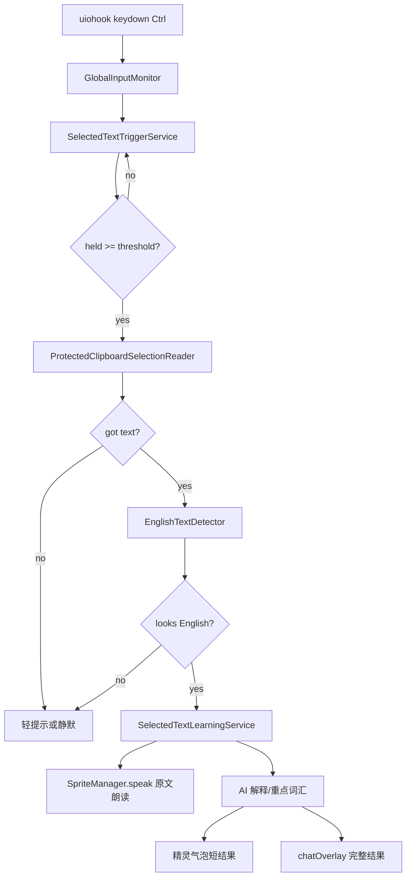
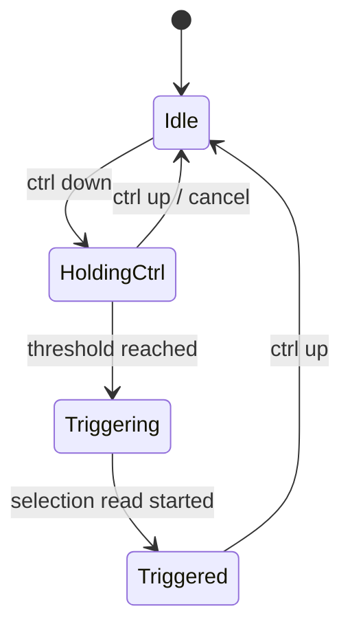

# 选中文本英语学习助手实施文档

## 目标

当用户在任意应用中选中文本后，长按 `Ctrl` 达到设定时长，精灵自动尝试读取当前选区。如果文本判断为英语，则朗读原文，并调用 AI 生成中文解释、重点词汇、短语与学习提示，最后通过精灵气泡或浮层展示结果。

第一版采用“剪贴板保护式复制”读取选中文本，不引入 Windows UI Automation 或 native addon。

## 第一版范围与现状

当前第一版已落地：主进程通过 `GlobalInputMonitor` 复用 `uiohook-napi`，长按 `Ctrl` 后走剪贴板保护式复制，完成英语检测、原文朗读、AI 结构化解释、精灵气泡摘要和 `chatOverlay` 完整解释展示。默认关闭，需要在设置页“划词学习”中开启。

### 包含

- 全局监听 `Ctrl` / `Right Ctrl` 按下与松开。
- 长按阈值触发，默认建议 `1500ms`。
- 使用剪贴板保护式 `Ctrl+C` 读取外部应用选区文本。
- 本地英语启发式检测，过滤空文本、中文文本、代码片段和过长文本。
- 朗读原文，复用现有 `SpriteManager.speak` / `SpeakService`。
- 调用 AI 生成解释结果。
- 用精灵 notice/bubble 展示短结果；必要时打开 `chatOverlay` 展示已生成的完整解释。
- 提供基础设置项：启用开关、长按时长、是否自动朗读、最大文本长度。

### 不包含

- 不做无剪贴板读取模式。
- 不做 OCR 读取图片/PDF 截图文字。
- 不覆盖所有高权限窗口或安全输入框。
- 不在第一版实现复杂词典缓存、历史记录、学习卡片复习。

## 现有可复用能力

- `uiohook-napi` 已安装，可监听全局键盘与鼠标事件。
- 当前全局鼠标移动监听在 `electron/main/handlers/window.ts`，用于透明窗口 hover/click-through。
- 全局快捷键系统在 `electron/main/shortcuts.ts`，但 `globalShortcut` 不适合“单独长按 Ctrl”。
- 精灵 TTS 在 `packages/sprite-core/manager/sprite-manager.ts` 的 `speak` 与 `showNotice` 中已有完整链路。
- `chatOverlay` 已扩展支持通过窗口 payload 传入 `initialMessages`，用于直接展示已生成内容，避免同一段文本二次请求 AI。
- 精灵气泡独立窗口 `spriteBubbleFixedTop` 已支持跟随主精灵展示消息。

## 总体架构



## 模块设计

### 1. GlobalInputMonitor

已新增：

`electron/main/global-input-monitor.ts`

职责：

- 统一管理 `uiohook-napi` 的 `start()` / `stop()`。
- 允许多个功能订阅事件，避免 hover 监听和长按 Ctrl 互相 `stop()`。
- 暴露 `onKeyDown`、`onKeyUp`、`onMouseMove` 等订阅方法。
- 内部维护 listener map 和引用计数。
- `uiohook-napi` 不可用时仅让订阅失败，不影响主进程启动。

现有 `electron/main/handlers/window.ts` 中 hover monitor 后续应迁移到该服务。

### 2. SelectedTextTriggerService

已新增：

`electron/main/selected-text/trigger-service.ts`

职责：

- 监听 `UiohookKey.Ctrl` 与 `UiohookKey.CtrlRight`。
- 第一次 `keydown` 开始计时；重复 `keydown` 不重复启动定时器。
- `keyup` 清理定时器并重置触发状态。
- 达到阈值后只触发一次，直到 Ctrl 松开。
- 最近文本由 `SelectedTextLearningService` 去重，避免同一选区反复触发。
- 在用户按下其他键、鼠标点击或窗口焦点变化时取消本轮触发。

状态机：



### 3. ProtectedClipboardSelectionReader

已新增：

`electron/main/selected-text/protected-clipboard-selection-reader.ts`

职责：

- 读取并保存当前剪贴板文本、HTML、RTF、图片等可恢复内容。
- 模拟 `Ctrl+C`。
- 短暂等待目标应用写入剪贴板，建议 `120ms`，必要时重试一次。
- 读取 `clipboard.readText()`。
- 尽量恢复原剪贴板内容。
- 返回 `{ text, source: 'clipboard-copy', restored, elapsedMs }`。

实现细节：

- 使用 Electron `clipboard` 保存/恢复常见格式。
- 使用 `uIOhook.keyTap(UiohookKey.C, [UiohookKey.Ctrl])` 模拟复制。
- 复制前后对比剪贴板文本，若没有变化但原剪贴板为空，也允许作为候选文本。
- 如果目标应用阻止复制或选区为空，返回空文本。
- 读取期间设置 `busy` 标记，防止并发触发。

注意：

- 第一版会短暂修改系统剪贴板，但应在毫秒级恢复。
- 如果目标应用复制大对象或图片，恢复可能不完整；设置页需要明确提示。
- 密码框、安全输入框通常不会返回文本，应静默失败。

### 4. EnglishTextDetector

已新增：

`electron/main/selected-text/english-text-detector.ts`

建议规则：

- `trim()` 后长度在 `3-2000` 字符内。
- 至少包含 2 个英文字母，或一个明显英文单词。
- 拉丁字符占可见字符比例大于 `0.55`。
- 中文/日文/韩文字符比例低于 `0.2`。
- 排除明显文件路径、URL-only、JSON-only、代码块-only。
- 如果包含完整英文句子标点或空格分词，提升置信度。

返回：

```ts
type EnglishDetectionResult = {
  ok: boolean;
  confidence: number;
  reason?: string;
  normalizedText?: string;
};
```

### 5. SelectedTextLearningService

已新增：

`electron/main/selected-text/learning-service.ts`

职责：

- 编排读取文本、检测、朗读、AI 解释和展示。
- 做请求取消与防抖。
- 统一错误处理与轻提示。

推荐输出结构：

```ts
type SelectedTextLearningResult = {
  original: string;
  translation: string;
  explanation: string;
  keyWords: Array<{
    word: string;
    meaning: string;
    note?: string;
  }>;
  phrases: Array<{
    phrase: string;
    meaning: string;
  }>;
  usageTips?: string[];
};
```

AI prompt 要求：

- 输出中文。
- 解释简洁，优先帮助理解当前语境。
- 重点词汇不要超过 6 个。
- 短语不要超过 4 个。
- 返回 JSON，便于稳定渲染。

### 6. 展示策略

第一版使用两级展示：

- 短文本或 AI 结果摘要：用 `SpriteManager.showNotice` 或 `showToast` 显示。
- 解释较长：打开 `chatOverlay`，传入 `initialMessages`，直接展示本次后台 AI 已生成的学习结果。

可选交互：

- 气泡按钮：`查看解释`、`关闭`。
- `查看解释` 打开 `chatOverlay`。
- `重新朗读` 再次调用 `SpriteManager.speak(original, { showBubble: false })`。

## 设置项

建议新增配置文件：

`<userData>/data/selected-text-learning.json`

默认值：

```json
{
  "enabled": false,
  "holdMs": 1500,
  "autoSpeak": true,
  "showOverlay": true,
  "maxTextLength": 2000,
  "restoreClipboard": true,
  "dedupeWindowMs": 8000
}
```

设置页已新增为“划词学习”分类。因为这不是传统快捷键，而是长按修饰键触发，页面文案说明为“长按触发”。

## IPC 与 preload

已新增主进程 IPC：

- `selectedTextLearning:getConfig`
- `selectedTextLearning:setConfig`
- `selectedTextLearning:getStatus`
- `selectedTextLearning:testReadSelection`
- `selectedTextLearning:triggerNow`
- `selectedTextLearning:openLatestOverlay`

preload 暴露在：

`window.YUA.selectedTextLearning`

用途：

- 设置页读写配置。
- 调试按钮手动测试选区读取。
- 后续 UI 可主动触发。

## 生命周期

应用启动后：

1. 初始化配置。
2. 如果 `enabled = true`，启动 `SelectedTextTriggerService`。
3. 设置变更时动态启停监听。
4. 应用退出时取消定时器、移除订阅。

触发流程：

1. 用户选中文本。
2. 用户长按 Ctrl。
3. 到阈值后读取选区。
4. 恢复剪贴板。
5. 本地判断英语。
6. 先朗读原文。
7. 同时或随后请求 AI 解释。
8. 展示解释摘要，必要时打开浮层。

## 风险与处理

| 风险 | 处理 |
| --- | --- |
| 剪贴板恢复不完整 | 保存 text/html/rtf/image 等常见格式；设置中说明；提供关闭开关 |
| 目标应用复制慢 | 等待 120ms 后读取，失败可再等 180ms 重试一次 |
| 长按 Ctrl 影响用户正常快捷键 | 只有单独 Ctrl 按住才计时；按下其他键取消 |
| 误判代码为英语 | 增加代码/JSON/path/URL 检测；允许用户关闭 |
| 高权限应用无法复制 | 静默失败或轻提示“不支持当前窗口” |
| AI 请求慢 | 先朗读和展示“解析中”；AI 完成后更新气泡或打开 overlay |
| 和 hover monitor 争用 uiohook | 先抽 GlobalInputMonitor 统一订阅 |

## 实施步骤

### 阶段 1：输入监听基础设施

- [x] 抽出 `GlobalInputMonitor`。
- [x] 将现有 hover mousemove 迁移为订阅模式。
- [ ] 验证透明窗口 hover/click-through 行为不回退。

### 阶段 2：剪贴板读取与检测

- [x] 实现 `ProtectedClipboardSelectionReader`。
- [x] 实现 `EnglishTextDetector`。
- [x] 增加 `testReadSelection` IPC，方便设置页或开发者测试。

### 阶段 3：长按 Ctrl 触发

- [x] 实现 `SelectedTextTriggerService`。
- [x] 支持配置启停、长按阈值、去重窗口。
- [x] 加基础日志，记录启动/触发失败等原因。

### 阶段 4：AI 与精灵展示

- [x] 实现 `SelectedTextLearningService`。
- [x] 复用 `SpriteManager.speak` 朗读原文。
- [x] 调用现有 AI chat/ephemeral 能力生成 JSON 解释。
- [x] 用气泡展示摘要，用 `chatOverlay` 展示完整内容。

### 阶段 5：设置页与验收

- [x] 新增设置项。
- [x] 加手动测试按钮。
- [ ] 验证浏览器、VS Code、记事本、PDF 阅读器、聊天软件输入框等常见场景。

## 验收清单

- 关闭功能时不注册长按 Ctrl 监听。
- 长按 Ctrl 超过阈值才触发，短按不触发。
- 按住 Ctrl 后再按其他键不会触发。
- 成功读取外部应用选中文本后，原剪贴板能恢复。
- 非英语文本不触发 AI 与 TTS。
- 英语文本会朗读原文。
- AI 解释包含中文解释、重点词汇和短语。
- 同一段文本短时间内不会重复触发。
- `uiohook` 失败时应用仍能正常启动。
- 现有精灵 hover/click-through 行为不受影响。

## 后续升级方向

- Windows UI Automation 无剪贴板读取模式。
- OCR 选区/截图识别模式。
- 生词本与学习历史。
- 单词点击发音。
- 根据用户水平自动调整解释深度。
- 支持 Shift/Ctrl/Alt 等不同长按触发键。
