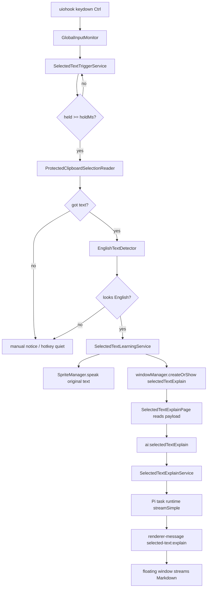

# 选中文本英语助手实施文档

## 目标

用户在任意可复制文本的应用中选中英文后，长按 `Ctrl` 达到阈值，精灵读取当前选区。如果文本被本地规则判断为英语，则朗读原文，并打开独立的划词解释浮窗。浮窗通过轻量 AI 解释服务流式生成译文、语境解释、重点词汇和用法提示。

第一版使用“剪贴板保护式复制”读取选中文本，不引入 Windows UI Automation、OCR 或新的 native addon。

## 当前设计决策

- 保留单独的“划词学习”设置页，用于配置启用状态、长按时长、朗读、是否打开浮窗、剪贴板恢复、最大文本长度和去重窗口。
- 不在“划词学习”设置页维护单独的 LLM provider/model/preset。
- 浮窗复用普通聊天的模型选择配置，也就是 `chat.sel.providerId`、`chat.sel.modelId` 和 `chat.sel.presetId`。
- 解释展示使用新增的独立窗口 `selectedTextExplain`，不打开 `ChatPage`，不打开 `chatOverlay`，不创建会话，不调用 agent/tool workflow。
- AI 调用使用新增的轻量 task service：`SelectedTextExplainService`。默认先发 `quick` 请求，只输出简单翻译和一句简释；用户点击“详细释义”后再发 `detail` 请求，补充语境、重点词汇和用法。
- 浮窗打开位置使用触发时的 `screen.getCursorScreenPoint()` 作为锚点，贴近鼠标/选区附近并夹取到当前显示器工作区内。剪贴板保护式复制只能读到文本，第一版不能精确获得外部应用的选区矩形。
- 解释页在 renderer 侧维护 quick/detail 两套 typewriter buffer；即使 provider 只在完成时返回全文，也会按小块逐步展示，避免结果一次性跳出。

## 第一版范围

### 包含

- 监听全局 `Ctrl` / `Right Ctrl` 按下与松开。
- 长按阈值触发，默认 `1500ms`。
- 使用保护式 `Ctrl+C` 读取外部应用选区文本，并尽量恢复原剪贴板内容。
- 本地英语启发式检测，过滤空文本、中文文本、代码片段、路径、URL-only 和过长文本。
- 复用 `SpriteManager.speak` 朗读选中的英文原文。
- 打开独立 `selectedTextExplain` 浮窗。
- 浮窗按触发时鼠标位置附近打开，先启动 `ai:selectedTextExplain` 的 `quick` 任务并以打字机节奏展示简单翻译/简释；展开后再启动 `detail` 任务加载更多解释。
- 提供 IPC 调试入口：读取配置、读取选区测试、手动触发、打开最近一次解释窗口。

### 不包含

- 不做单独 LLM 配置页。
- 不使用 `ChatPage` / `chatOverlay` 承载划词解释。
- 不创建聊天会话，不写入聊天历史。
- 不调用 agent 或工具链。
- 不做结构化 JSON 解释结果解析。
- 不做无剪贴板读取模式。
- 不做 OCR 读取图片/PDF 截图文字。
- 不在第一版实现学习历史、生词本和复习卡片。

## 触发方式

1. 在任意可复制文本的应用中选中一段英文。
2. 松开鼠标后，单独按住 `Ctrl`。
3. 持续约 `1.5s`。
4. 主进程模拟 `Ctrl+C` 读取当前选区。
5. 如果文本通过英语检测，精灵朗读原文。
6. 同时打开 `selectedTextExplain` 浮窗。
7. 浮窗使用当前聊天模型配置启动轻量解释任务，并流式展示结果。

调试入口：

```ts
await window.YUA.selectedTextLearning.getStatus();
await window.YUA.selectedTextLearning.testReadSelection();
await window.YUA.selectedTextLearning.triggerNow();
```

## 总体架构



## 模块设计

### GlobalInputMonitor

文件：
`electron/main/global-input-monitor.ts`

职责：

- 统一加载和管理 `uiohook-napi`。
- 支持 `keydown`、`keyup`、`mousemove`、`mousedown`、`mouseup` 多事件订阅。
- 多个功能共享同一个 hook，避免互相 `start()` / `stop()`。
- 暴露 `keys`、`keyTap()`、`keyToggle()`，供保护式复制使用。
- `uiohook-napi` 不可用时仅让订阅失败，不影响主进程启动。

### SelectedTextTriggerService

文件：
`electron/main/selected-text/trigger-service.ts`

职责：

- 监听 `Ctrl` 和 `Right Ctrl`。
- 第一次 `keydown` 开始计时，重复 `keydown` 不重复启动定时器。
- `keyup`、其他按键或鼠标按下会取消本轮触发。
- 达到阈值后只触发一次，直到本次 `Ctrl` 松开。

### ProtectedClipboardSelectionReader

文件：
`electron/main/selected-text/protected-clipboard-selection-reader.ts`

职责：

- 读取并保存当前剪贴板文本、HTML、RTF、图片等常见内容。
- 清空剪贴板后模拟 `Ctrl+C`。
- 等待目标应用写入剪贴板，默认先等 `120ms`，空文本时再等 `180ms`。
- 读取 `clipboard.readText()`。
- 尽量恢复原剪贴板内容。
- 返回 `{ text, source: 'clipboard-copy', restored, elapsedMs }`。

### EnglishTextDetector

文件：
`electron/main/selected-text/english-text-detector.ts`

职责：

- `trim()` 后校验长度，默认最大 `2000` 字符。
- 要求包含足够英文字符或明显英文单词。
- CJK 字符占比过高时拒绝。
- 排除明显路径、URL-only、JSON-only、代码块-only 文本。
- 返回 `EnglishDetectionResult`，包含 `ok`、`confidence`、`reason` 和 `normalizedText`。

### SelectedTextLearningService

文件：
`electron/main/selected-text/learning-service.ts`

职责：

- 编排读取选区、英语检测、去重、朗读和打开解释浮窗。
- 对同一段文本做短时间去重，默认 `8000ms`。
- 通过 `rememberWindowPayload('selectedTextExplain', { text, trigger, anchor })` 写入窗口 payload。
- 调用 `windowManager.createOrShow('selectedTextExplain', payload, { beforeShow })`，在显示前按 `anchor` 定位，并在复用已隐藏窗口时再次定位。

### SelectedTextExplainPage

文件：
`src/pages/SelectedTextExplainPage/SelectedTextExplainPage.tsx`

职责：

- 读取 `selectedTextExplain` 窗口 payload。
- 复用 `ChatSelectionProvider` 中的 `providerId`、`modelId`、`presetId`。
- 如果没有模型，尝试从当前 provider 的模型列表选择第一个模型。
- 调用 `window.YUA.ai.explainSelectedText()` 启动流式任务；默认 `options.mode = 'quick'`，展开后再请求 `options.mode = 'detail'`。
- 监听 `renderer-message` 中 `selected-text:explain` 事件。
- 将 quick/detail 的 `delta` 和 `completed` 全文分别写入本地 typewriter buffer，再按小块刷新 Markdown，支持复制、重新生成、关闭。

### SelectedTextExplainService

文件：
`packages/ai/services/selected-text-explain-service.ts`

职责：

- 管理独立划词解释 task registry。
- 构造两档 prompt：`quick` 只要译文和一句简释，`detail` 才输出完整语境、重点词汇和用法提示。
- 接受 `chatFn` 并流式转发 `delta`。
- 发出 `connected`、`progress`、`delta`、`completed`、`error`、`done` 事件。
- 支持取消任务。
- 记录 provider usage，归类到 `translation/content_processing`。

## 窗口与路由

新增窗口 key：

```ts
selectedTextExplain
```

新增路由：

```tsx
<Route path="/selected-text-explain" element={<SelectedTextExplainPage />} />
```

窗口特性：

- 约 `460x540`
- 无边框
- 透明背景
- always on top
- hide on close
- 可调整大小

## IPC 与 preload

划词读取与设置：

- `selectedTextLearning:getConfig`
- `selectedTextLearning:setConfig`
- `selectedTextLearning:getStatus`
- `selectedTextLearning:testReadSelection`
- `selectedTextLearning:triggerNow`
- `selectedTextLearning:openLatestOverlay`

AI 解释任务：

- `ai:selectedTextExplain`
- `ai:cancelSelectedTextExplain`

Renderer API：

```ts
await window.YUA.ai.explainSelectedText({
  providerId,
  providerPresetId,
  model,
  text,
  targetLanguage: 'zh-CN',
  languageNames: { 'zh-CN': '中文' }
});

await window.YUA.ai.cancelSelectedTextExplain(requestId);
```

流式事件：

```ts
{
  type: 'selected-text:explain',
  data: {
    requestId,
    type: 'delta',
    data: { text: '...' }
  }
}
```

## 配置

配置文件：
`<userData>/data/selected-text-learning.json`

默认值：

```json
{
  "enabled": true,
  "holdMs": 1500,
  "autoSpeak": true,
  "showOverlay": true,
  "maxTextLength": 2000,
  "restoreClipboard": true,
  "dedupeWindowMs": 8000
}
```

说明：

- `enabled`：是否注册长按 `Ctrl` 监听。
- `holdMs`：长按触发阈值。
- `autoSpeak`：触发成功后是否朗读原文。
- `showOverlay`：是否打开独立解释浮窗。
- `maxTextLength`：英语检测允许的最大文本长度。
- `restoreClipboard`：读取完成后是否恢复剪贴板。
- `dedupeWindowMs`：同一段文本短时间内不重复触发。

该配置不包含 LLM provider、model 或 preset。

## 验收清单

- 长按 `Ctrl` 超过阈值才触发，短按不触发。
- 按住 `Ctrl` 后再按其他键不会触发。
- 成功读取外部应用选中文本后，原剪贴板尽量恢复。
- 非英文文本不触发朗读和解释浮窗。
- 英文文本会朗读原文。
- 打开的是 `selectedTextExplain` 独立窗口，不是 `chatOverlay`。
- 解释由 `ai:selectedTextExplain` 流式返回。
- 首次打开只请求 quick 简单释义，能更快返回可用翻译。
- 点击“详细释义”按钮后才单独请求 detail 内容，且不会覆盖 quick 结果。
- 即使上游只返回 `completed.text`，解释页也会显示可见的打字机效果。
- 浮窗会出现在触发时鼠标/选区附近，并保持在当前显示器工作区内。
- 不创建聊天会话，不调用 agent，不执行工具。
- 解释浮窗复用普通聊天当前模型配置。
- 同一段文本短时间内不会重复触发。
- `uiohook` 失败时应用仍能正常启动。

## 后续升级方向

- Windows UI Automation 无剪贴板读取模式，并获取精确选区矩形用于贴边定位。
- OCR 选区/截图识别模式。
- 生词本与学习历史。
- 单词点击发音。
- 根据用户水平自动调整解释深度。
- 支持 Shift/Ctrl/Alt 等不同长按触发键。
