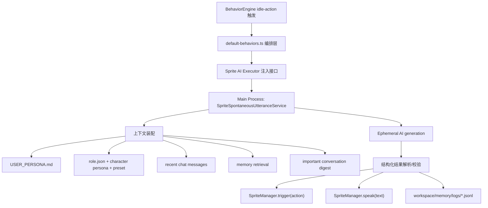

# Sprite AI 自发说话设计方案 v1

> 目标：在 `createActionBehavior()` 对应的自发小动作触发时，让精灵先基于 AI 生成一句有触动感的“主动提醒/鼓励/感悟/有趣一句话”，再配合动作和语音说出来，并将这类自发说话记录为可追踪的历史。

---

<!-- AUTO-GENERATED:SPRITE-AI-STATUS START -->
## Auto Status

- Last synced: 2026-04-09 10:26:40
- Sync command: `pnpm docs:sprite-ai:sync`
- Phase 1: implemented
- Phase 2: implemented
- Phase 3: implemented
- Phase 4: implemented

### Current Chain
- Trigger path: `idle-action` -> `spontaneousUtteranceExecutor` -> `SpriteSpontaneousUtteranceService`
- Context inputs: persona, role definition, recent chat, persistent memory retrieval, important dialogue digests
- History log: `<workspace>/memory/logs/sprite-spontaneous-utterances-YYYY-MM-DD.jsonl`

### Auto Checks
- sprite-core injection interface: implemented
- idle-action AI orchestration: implemented
- main-process spontaneous service: implemented
- persona / role / recent chat context: implemented
- persistent memory retrieval: implemented
- important dialogue digests: implemented
- JSONL history logging: implemented
- doc sync script: implemented

### Tracked Files
- `packages/sprite-core/manager/types.ts`
- `packages/sprite-core/manager/sprite-manager.ts`
- `packages/sprite-core/manager/default-behaviors.ts`
- `packages/sprite-core/handler/sprite-manager-ipc.ts`
- `electron/main/handlers/index.ts`
- `electron/main/handlers/status.ts`
- `electron/main/handlers/memory/ipc-main.ts`
- `electron/main/handlers/sprite/spontaneous-utterance-service.ts`
- `electron/main/handlers/memory/retrieval-db-deps.ts`
- `package.json`
- `scripts/update-sprite-ai-doc.mjs`
<!-- AUTO-GENERATED:SPRITE-AI-STATUS END -->

## 1. 背景与目标

当前 `sprite-core` 已经具备成熟的自发行为调度能力，也具备气泡与 TTS 播放能力，但“自发说话”仍然主要依赖预设文案或随机触发，缺少真正结合用户上下文、助手角色、近期对话与持久记忆的智能生成能力。

这次目标不是简单地给 `createActionBehavior()` 加一句随机台词，而是把它升级为一个新的“AI 自发表达入口”：

1. 触发源仍然是现有的闲置小动作行为。
2. 当该行为触发时，先由 AI 生成一句短小但有温度的内容。
3. 这句话要能参考：
   - 当前用户画像
   - 当前助手角色定义
   - 最近聊天记忆
   - 持久记忆
   - 重要对话内容
4. AI 不只生成文本，还要给出口气、情绪、意图类别、建议动作风格等结构化信息。
5. 最终由精灵助手说出，并留下可追踪、可回放、可分析的历史记录。

本设计文档先聚焦架构与落地方案，不在本阶段直接实施代码。

---

## 2. 需求拆解

从需求语义看，这个能力至少包含 5 个子目标：

### 2.1 生成目标

AI 输出的一句话应该满足以下特征：

1. 只有一句，足够短，适合气泡与 TTS。
2. 语气自然，像“精灵主动想到一句话想和你说”。
3. 内容类型允许覆盖：
   - 哲理感悟
   - 鼓舞提醒
   - 有趣玩笑
   - 轻提醒
   - 温柔督促
   - 计划安排建议
   - 对当前状态的共情回应
4. 文案应尽量贴近当前用户，而不是泛化鸡汤。

### 2.2 上下文目标

模型看到的输入不能只是一段 prompt，而是明确拼装后的上下文包，包括：

1. 用户长期画像
2. 助手角色设定
3. 当前会话最近消息
4. 工作区可召回的长期记忆
5. 最近高重要度对话摘要
6. 当前精灵状态与行为触发信息

### 2.3 表达目标

除了文本本身，还需要结构化表达信息，至少包括：

1. `intentCategory`：这句话属于鼓励、提醒、幽默、计划、哲思等哪一类
2. `tone`：温柔、俏皮、沉静、笃定、体贴等
3. `emotion`：暖心、好奇、轻快、认真、安抚等
4. `recommendedAction`：和说话更匹配的小动作建议

### 2.4 工程目标

1. 不破坏 `sprite-core` 的纯逻辑边界。
2. 不让 `packages/sprite-core` 直接依赖 `packages/ai`。
3. 失败时不影响原本的小动作行为。
4. 后续可以把所有“自发说过的话”完整沉淀下来。

### 2.5 未来扩展目标

后面还可能继续扩展：

1. 同一类话术去重
2. 根据情绪自动映射动作与动画
3. 将自发说话本身再作为“精灵记忆”输入
4. 做成可配置功能开关、频率控制、风格偏好

---

## 3. 现状分析

## 3.1 `createActionBehavior()` 的真实位置

当前 `createActionBehavior()` 位于 `packages/sprite-core/behavior-engine.ts`，它本质上只是一个行为定义工厂，负责提供：

1. 行为 id
2. schedule
3. 条件
4. 概率
5. 默认 action 占位

真正的小动作行为逻辑是在 `packages/sprite-core/manager/default-behaviors.ts` 里覆写 `actionDef.action` 时完成的。当前逻辑是：

1. 读取当前 `favor`
2. 从基础动作池 / 高好感动作池里随机取一个动作
3. 调 `mgr.trigger(picked)`

这意味着：

1. 最适合接 AI 的位置不是 `createActionBehavior()` 工厂本体
2. 而是默认行为注册层，尤其是 `default-behaviors.ts` 中 `idle-action` 的具体执行逻辑

结论：保留 `createActionBehavior()` 作为“触发条件与调度定义”更合理，把 AI 编排放到默认行为 action 或其依赖注入层。

## 3.2 `SpriteManager` 已具备发声能力

`packages/sprite-core/manager/sprite-manager.ts` 已经提供：

1. `mgr.trigger(eventType)`：触发动效和气泡
2. `mgr.showToast(text)`：展示气泡，并可能触发朗读
3. `mgr.speak(text, { showBubble: true })`：直接发声并显示气泡

因此这个需求不需要重做发声层，重点是：

1. 先生成内容
2. 再把内容交给 `mgr.speak(...)`
3. 同步或近同步地触发一个匹配动作

## 3.3 `BehaviorContext` 目前不承载 AI 上下文

`BehaviorContext` 当前只包含：

1. `spriteState`
2. `personaState`
3. `interactionStats`
4. `now`
5. `screenSize`
6. `position`
7. `custom`

它并不包含：

1. 当前会话 id
2. 当前 workspace id
3. 用户画像
4. 记忆召回结果
5. AI provider / preset 信息

结论：不要试图把所有 AI 依赖塞进 `BehaviorContext`。更合理的方式是由主进程额外注入一个“AI 自发说话执行器”，在行为触发时再去装配上下文。

## 3.4 现有 enrichers 不能直接满足本需求

现有系统里已经有：

1. 用户画像注入器 `electron/main/handlers/user-profile/user-profile-enricher.ts`
2. 记忆自动召回注入器 `electron/main/handlers/memory/memory-auto-recall-enricher.ts`

但这两者都在 `request.persist === false` 时跳过执行。而自发说话能力天然更适合走：

1. 非持久化
2. 不落入正式聊天消息流
3. 不打断主会话

当前代码里 `persist: false` 的链路已经广泛用于临时生成任务，因此不能寄希望于“直接调一次 ephemeral chat，然后 enrichers 自动把画像和记忆塞进来”。

结论：这个功能必须显式拼装上下文，不能隐式依赖 enrichers。

这是本设计里最重要的架构前提。

## 3.5 可复用的上下文来源

当前代码库里，可复用来源已经足够完整：

1. 用户画像
   - 工作区 `memory/USER_PERSONA.md`
   - 解析能力在 `packages/ai/services/persona-document.ts`
2. 长期记忆检索
   - `packages/ai/services/memory-retrieval-service.ts`
   - `memory/MEMORY.md` 应优先作为“长期记忆摘要”参与上下文，而 `memory/INDEX.md` 只用于人工浏览，不应主导 prompt
   - `MEMORY.md` 的内容应优先来自各 note 的 `Recall Cues`（长期记忆候选），而不是把最近 note 摘要机械拼接成目录式上下文
3. 最近聊天消息
   - `ChatRepo.listMessages(conversationId)`，定义在 `electron/main/db/repositories.ts`
4. 当前助手角色
   - 精灵角色文件：`electron/main/handlers/status.ts` 中的 `role.json`
   - 角色人格 prompt builder：`packages/sprite-core/character-service.ts` 中的 `buildCharacterPersonaPrompt()`
   - 用户 preset 的 `systemPrompt`：`packages/ai/runtime/pi/model-resolver.ts`
5. 精灵当前状态
   - 可直接从 `BehaviorContext` 和 `SpriteManager` 获取

结论：问题不在于“拿不到数据”，而在于“如何在正确边界里把这些数据编排成一次稳定、可控、低噪音的生成调用”。

---

## 4. 设计原则

本方案遵守以下原则：

1. `sprite-core` 保持纯逻辑，不直连 AI。
2. AI 侧能力放在 Electron main 进程编排。
3. 生成链路显式装配上下文，不依赖隐式 enrichers。
4. 失败可降级，不能影响已有 idle-action。
5. 输出必须结构化，不能只要一句裸文本。
6. 日志必须落地到 workspace，方便后续做历史与分析。
7. 限频与去重是第一版就要设计进去的，不然后面会非常吵。

---

## 5. 总体架构方案

推荐新增一个主进程服务，暂定名：

`SpriteSpontaneousUtteranceService`

建议放在 Electron main 侧，例如：

`electron/main/handlers/sprite/spontaneous-utterance-service.ts`

或者未来若 sprite handler 目录拆分，更适合放在：

`electron/main/services/sprite/spontaneous-utterance-service.ts`

### 5.1 架构分层



### 5.2 关键边界

1. `packages/sprite-core`
   - 只负责行为触发、动画、状态、发声执行
   - 不负责知道“AI 怎么生成”
2. Electron main
   - 负责知道“当前 workspace / conversation / provider / role / memory 是什么”
   - 负责组装 prompt 和调模型
3. 日志落在 workspace
   - 保持和用户画像、记忆系统一样的 workspace 归属关系

---

## 6. 推荐的未来实现切点

## 6.1 不建议直接改 `createActionBehavior()`

不建议把 AI 调用写进 `behavior-engine.ts`，原因有三点：

1. 会让 `BehaviorEngine` 从纯调度层变成业务编排层
2. 会把 `sprite-core` 和 AI/数据库/工作区语义耦合起来
3. 后面别的自发行为若也想接 AI，会进一步污染基础层

## 6.2 推荐改造点

推荐的改造方式是：

1. 在 `SpriteManagerOptions` 增加一个可选依赖注入接口
2. 由 `SpriteManager` 持有该接口
3. 在 `registerDefaultBehaviors(mgr)` 注册 `idle-action` 时调用该接口

可参考的目标接口：

```ts
export interface SpriteSpontaneousUtteranceExecutor {
  generateForIdleAction(input: IdleActionUtteranceRequest): Promise<IdleActionUtteranceResult | null>;
}
```

其中：

1. `sprite-core` 只依赖接口类型，不依赖 AI 包
2. 实际实现由 Electron main 初始化 `SpriteManager` 时传入

## 6.3 推荐触发方式

当 `idle-action` 触发时：

1. 先从动作池里准备候选动作
2. 调用 `generateForIdleAction(...)`
3. 若成功返回：
   - 取 `recommendedAction`，没有则回退到本地随机动作
   - 调 `mgr.trigger(action)`
   - 再调 `mgr.speak(text, { showBubble: true })`
4. 若失败或超时：
   - 回退为当前逻辑，只做 `mgr.trigger(randomAction)`

推荐顺序是“先生成，再动作+发声”，因为这样可以让动作与语气更一致。

---

## 7. 上下文装配设计

自发说话的核心不是模型本身，而是上下文装配质量。

建议把生成输入整理为统一结构：

```ts
type IdleActionUtteranceRequest = {
  workspaceId: string;
  conversationId?: string;
  providerId?: string;
  providerPresetId?: string;
  behaviorId: 'idle-action';
  triggeredAt: number;
  sprite: {
    state: string;
    mood: string;
    moodIntensity: number;
    favor: number;
    level: number;
    idleDurationMs: number;
  };
  actionCandidates: string[];
  userProfile?: {
    snapshot?: string;
    topFacts: string[];
  };
  characterRole?: {
    roleName?: string;
    roleMood?: string;
    roleFavor?: number;
    roleDescription?: string;
    characterPersonaPrompt?: string;
    presetSystemPrompt?: string;
  };
  recentConversation?: {
    conversationSummary?: string;
    recentMessages: Array<{ role: string; content: string; ts?: number }>;
  };
  persistentMemory?: {
    recalledNotes: Array<{ noteId: string; summary: string; importance: number; topics: string[] }>;
  };
  importantDialogues?: Array<{
    source: 'recent-chat' | 'memory-note';
    summary: string;
    reason: string;
  }>;
};
```

## 7.1 用户画像

来源：

1. `<workspace>/memory/USER_PERSONA.md`
2. 通过 `parsePersonaMarkdown()`、`extractSnapshot()`、`extractTopFacts()` 提取精简信息

建议注入内容：

1. `snapshot`
2. `topFacts` 最多 6 条

不要把整份 persona 文档原封不动塞给模型，否则：

1. token 冗余
2. 与短句生成任务不匹配
3. 会稀释近期对话的重要性

## 7.2 助手角色定义

“当前助手角色定义”建议由三层组成：

1. 精灵角色状态
   - `role.json`
   - 包含 `name / mood / level / favor / description`
2. 角色人格 prompt
   - `packages/sprite-core/character-service.ts`
   - 复用 `buildCharacterPersonaPrompt()` 的输出，作为说话风格、关系层级、当前心情的核心身份底色
   - 该 builder 应支持 `options` 做局部裁剪，例如只保留 `identity / relationship / speechStyle`，或在 `speechStyle` 内只取 `tone / firstPerson / quirks`
3. 当前 preset `systemPrompt`
   - 作为用户当前对模型的行为约束

推荐做法不是把几份原文全部注入，而是提前转成角色摘要：

```ts
type AssistantRoleDigest = {
  identity: string;
  styleRules: string[];
  relationshipTone: string[];
  currentRoleState: string[];
};
```

其中最重要的是 character persona prompt；如果自发说话链路继续走 one-shot task runtime，就不能依赖聊天 enrichers 隐式注入，而应该在主进程显式复用 `buildCharacterPersonaPrompt()` 的结果。并且不同场景应允许传入 `options`，只选择必要的人格字段，避免把整份角色设定无差别塞进 prompt。

## 7.3 最近聊天记忆

来源：

1. `ChatRepo.listMessages(conversationId)`

建议只截取最近一小段，例如：

1. 最近 12 到 20 条消息
2. 或最近 2 到 3 轮高信息密度轮次

并在送入模型前做一次轻量整理：

1. 过滤纯工具噪音
2. 截断超长内容
3. 保留最近用户真实情绪、目标、卡点、计划信息

## 7.4 持久记忆

来源：

1. `MemoryRetrievalService`

建议不要为自发说话做一次过重的“全局广泛检索”，而是做“轻量目标检索”：

1. 查询种子来自最近消息 + persona 关键词 + 当前精灵状态
2. 回召 3 到 5 条最相关 note 即可
3. 优先重要度高、稳定度高、和当前 conversation 主题接近的内容

推荐输出：

1. `summary`
2. `importance`
3. `topics`
4. 必要时的少量 `section summary`

## 7.5 重要对话内容

这里建议和“最近聊天记忆”区分开：

1. 最近聊天记忆强调原始上下文
2. 重要对话内容强调高信号摘要

“重要对话内容”可以来自两类：

1. 最近消息中提炼出的高信号片段
   - 用户最近提到的焦虑、计划、难点、期待
2. 记忆系统里高重要度 note
   - 最近 7 天内 importance 较高的内容

建议额外增加一个轻量摘要步骤，形成：

```ts
type ImportantDialogueDigest = {
  summary: string;
  reason: 'recent_goal' | 'recent_struggle' | 'recent_commitment' | 'long_term_pattern' | 'important_memory';
  freshness: 'current' | 'recent' | 'background';
};
```

## 7.6 精灵运行时状态

这是 AI 风格控制的重要输入，不能省：

1. 当前 mood
2. moodIntensity
3. favor
4. level
5. idleDuration
6. 当前时间段
7. 当前行为触发来源 `idle-action`

例如：

1. 深夜 + 高 idle + 轻疲惫 mood，更适合安静提醒
2. 高 favor + excited，更适合带点俏皮或鼓励
3. 低 favor 或 bored，不应该突然说过度亲密的话

---

## 8. 生成 Prompt 设计

建议把 prompt 拆成两层：

1. system：定义“你是精灵助手的自发说话生成器”
2. user：输入结构化上下文 JSON 或 markdown sections

## 8.1 System Prompt 目标

System prompt 应明确这些约束：

1. 只生成一句话
2. 不要套模板鸡汤
3. 不要脱离上下文硬抒情
4. 语气要像“熟悉用户的精灵助手”
5. 不能自说自话地编造用户没有表达过的重要事实
6. 如果上下文不足，可以更轻、更短、更含蓄
7. 输出必须是结构化 JSON

## 8.2 建议的输出 Schema

推荐第一版至少输出：

```json
{
  "text": "先把今天最重要的一件事做完，心就会慢慢安静下来。",
  "intentCategory": "reminder",
  "tone": "gentle",
  "emotion": "warm",
  "recommendedAction": "nod",
  "whyThisFits": "用户最近在任务切换和焦虑之间摇摆，这句更适合做轻提醒。"
}
```

字段说明：

1. `text`
   - 唯一真正对外说出的内容
2. `intentCategory`
   - `philosophy | encouragement | playful | reminder | planning | empathy | reflection`
3. `tone`
   - `gentle | playful | calm | firm | curious | tender`
4. `emotion`
   - `warm | hopeful | amused | thoughtful | soothing | bright`
5. `recommendedAction`
   - 当前可以映射到现有动作池，如 `wave/nod/lookRight/point/...`
6. `whyThisFits`
   - 仅用于日志，不展示给用户

## 8.3 文案约束建议

建议第一版限制：

1. 中文优先
2. 8 到 36 个汉字为宜
3. 最长不超过 60 个可见字符
4. 一次只说一句
5. 不使用列表
6. 不重复最近说过的话

这样能同时兼顾：

1. 气泡可读性
2. TTS 节奏
3. 精灵“突发一句”的自然感

---

## 9. 说话与动作协同策略

用户需求里强调的是：当小动作被触发时，先调 AI，再让精灵说出来。

因此推荐协同顺序：

1. `idle-action` 触发
2. 主进程服务生成一句话
3. 根据返回的 `recommendedAction` 选择动作
4. `mgr.trigger(action)`
5. 紧接着 `mgr.speak(text, { showBubble: true })`

### 9.1 为什么不是先动作后生成

如果先动作，再异步等 AI：

1. 动作和语气可能不一致
2. 用户会看到一个动作结束后突然补一句，节奏不自然
3. 后续要做“动作与情绪匹配”会更难

### 9.2 为什么也不能无限等待

如果 AI 生成太久，闲置行为就会卡住。

因此建议：

1. 生成超时控制在 3 到 5 秒
2. 超时直接降级为仅动作
3. 不重试，不阻塞行为主链路

---

## 10. 日志与历史记录设计

你明确提到后面希望把所有自发说过的话都记录下来，所以日志不是附属功能，而是核心需求的一部分。

## 10.1 存储位置

建议沿用 workspace memory 体系：

```text
<workspace>/memory/
  logs/
    sprite-spontaneous-utterances-YYYY-MM-DD.jsonl
```

选择 JSONL 的原因：

1. append-only，写入简单
2. 后续方便分析、筛选、统计
3. 可以逐日滚动
4. 不影响未来再导出 markdown 或 UI 面板

## 10.2 单条日志字段建议

```json
{
  "timestamp": 1712102400000,
  "workspaceId": "ws-xxx",
  "conversationId": "conv-xxx",
  "behaviorId": "idle-action",
  "triggerReason": "small-action-idle",
  "providerId": "openai",
  "providerPresetId": "preset-xxx",
  "model": "gpt-xxx",
  "latencyMs": 1820,
  "spriteState": {
    "mood": "curious",
    "moodIntensity": 68,
    "favor": 73,
    "level": 5,
    "idleDurationMs": 145200
  },
  "contextDigest": {
    "personaUsed": true,
    "recentMessageCount": 12,
    "memoryNoteCount": 4,
    "importantDigestCount": 3
  },
  "result": {
    "text": "先把今天最重要的一件事做完，心就会慢慢安静下来。",
    "intentCategory": "reminder",
    "tone": "gentle",
    "emotion": "warm",
    "recommendedAction": "nod",
    "whyThisFits": "..."
  },
  "executedAction": "nod",
  "spoken": true,
  "fallbackUsed": false
}
```

## 10.3 失败日志也应记录

如果生成失败，也建议写日志，但内容要轻量：

```json
{
  "timestamp": 1712102400000,
  "workspaceId": "ws-xxx",
  "conversationId": "conv-xxx",
  "behaviorId": "idle-action",
  "skipped": true,
  "reason": "cooldown|timeout|no_context|parse_failed|provider_unavailable",
  "fallbackAction": "wave"
}
```

这样后面才知道：

1. 为什么没说
2. 是限频导致，还是 AI 不可用
3. 当前参数是不是太保守

---

## 11. 限频、去重与降噪

这个能力如果不控频，会非常容易变成打扰源。

建议第一版就加入三层控制：

## 11.1 全局冷却

建议：

1. 两次 AI 自发说话间隔至少 15 到 30 分钟
2. 即使 `idle-action` 多次触发，也不必每次都说

推荐默认值：

`20 分钟`

## 11.2 每日上限

建议：

1. 每天最多 6 到 12 次
2. 高活跃用户也不要无限增加

推荐默认值：

`8 次/天`

## 11.3 文案去重

建议至少做两层：

1. 规范化文本完全相同去重
2. 最近若干条 `intentCategory + tone + 关键词` 高度相似时，降低再次通过概率

第一版可以先从简单规则开始：

1. 最近 20 条日志中出现完全相同 `text`，直接拒绝
2. 最近 5 条中同一 `intentCategory` 过多，降低本次触发概率

---

## 12. 错误处理与回退策略

这是一个典型的“增强能力”，不是主链路功能，因此必须坚持“失败无害”。

## 12.1 失败类型

需要考虑：

1. provider 不可用
2. 请求超时
3. 输出 JSON 不合法
4. 没有有效 conversation / workspace 上下文
5. persona / memory 文件不存在
6. 推荐动作不在当前动作池中

## 12.2 回退策略

统一回退为：

1. 不说话
2. 继续执行当前随机小动作
3. 写入失败日志

不要在第一版失败时再随机拼一句本地鸡汤，否则会让行为质量前后反差很大，不利于后续评估真实效果。

---

## 13. 可观测性与调试建议

建议为这个能力提供最小可观测性：

1. main 进程日志前缀
   - `[SpriteAIUtterance]`
2. JSONL 历史记录
3. 可选 debug 事件
   - 如 `sprite:spontaneous-utterance`

推荐打点阶段：

1. 开始装配上下文
2. 命中限频/跳过
3. 发起生成
4. JSON 解析结果
5. 最终动作与说话执行
6. 日志写入完成

这样未来你要调“为什么它最近不主动说话了”会轻松很多。

---

## 14. 推荐的实施分期

这部分是后续真正开工时的建议顺序。

## Phase 1：先打通最小链路

目标：

1. `idle-action` 触发时可调用主进程服务
2. 服务可拿到基础上下文
3. AI 可返回结构化结果
4. 精灵可说出一句话
5. JSONL 日志落地

这一阶段不追求复杂召回，只要：

1. 最近消息
2. persona 摘要
3. 角色人格摘要

先跑通即可。

## Phase 2：接入持久记忆与重要摘要

目标：

1. 接入 `MemoryRetrievalService`
2. 优先接入 `memory/MEMORY.md`，而不是只拼“最近重要对话摘要”
3. 提高文案贴合度

补充说明：

1. `MEMORY.md` 的质量依赖各 note 中的 `Recall Cues`。
2. 对历史 note 应允许后台渐进式回填 `Recall Cues`，避免自发说话长期退回“最近记忆兜底”。

这一阶段重点是提升内容质量，而不是 UI。

## Phase 3：做风格与动作联动

目标：

1. `tone/emotion` 驱动动作选择
2. 后续如 TTS 支持更丰富风格，可接入语音表达

## Phase 4：做历史分析与配置化

目标：

1. 查看历史自发说话记录
2. 用户控制频率与风格偏好
3. 允许关闭某些类别，如只保留提醒/鼓励

---

## 15. 建议的未来文件改动范围

这里只列建议范围，不代表本阶段已经实现。

可能涉及：

1. `packages/sprite-core/manager/types.ts`
   - 增加 AI 自发说话执行器接口
2. `packages/sprite-core/manager/sprite-manager.ts`
   - 保存注入依赖，供默认行为调用
3. `packages/sprite-core/manager/default-behaviors.ts`
   - 把 `idle-action` 从“纯随机动作”改成“AI 编排 + 回退动作”
4. `electron/main/.../spontaneous-utterance-service.ts`
   - 新增主进程编排服务
5. 可能的日志工具文件
   - 负责 JSONL append
6. 可能的 prompt/schema 文件
   - 便于后续调优与版本化

---

## 16. 关键开放问题

虽然整体方案已经清晰，但真正实施前还要明确几个点：

1. 当前“活动会话”如何定义
   - 是最后活跃 conversation
   - 还是当前绑定到精灵的 conversation
2. 没有 conversationId 时是否允许只基于 persona + memory 生成
3. 生成内容是否允许引用明确的待办/计划
   - 这会影响 prompt 的保守程度
4. 是否要给这个能力单独开关
   - 建议要有
5. 是否允许把自发说话内容再反哺进记忆系统
   - 第一版建议先只记录，不回流

---

## 17. 最终结论

这次需求的最佳落点不是改 `createActionBehavior()` 的抽象定义，而是在 `idle-action` 的执行层增加一个主进程 AI 编排服务。

核心结论如下：

1. 触发入口保留在 `idle-action`
2. AI 调度放到 Electron main，而不是 `sprite-core`
3. 上下文必须显式拼装，不能依赖 `persist: false` 下被跳过的 enrichers
4. 输出必须结构化，至少包括文本、口气、情绪、意图、建议动作
5. 失败必须无害降级
6. 历史记录必须从第一版开始就写入 `<workspace>/memory/logs/`

如果按这个方案推进，后续就能比较平滑地从“会主动说一句话”升级到：

1. 更懂用户状态
2. 更懂角色关系
3. 更会选择合适语气
4. 有完整可追踪历史
5. 可继续扩展为真正的“精灵主动陪伴表达系统”
